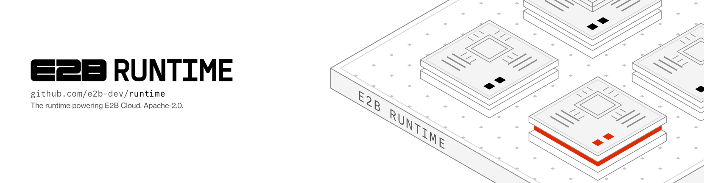

<picture>
  <source media="(prefers-color-scheme: dark)" srcset="./.github/assets/e2b-runtime-dark.png">
  
</picture>

<div align="center">

# E2B Runtime

**The open-source runtime behind [E2B](https://e2b.dev/?utm_source=github&utm_medium=referral&utm_campaign=readme&utm_content=runtime), the AI agent cloud. Firecracker microVMs that resume from a snapshot, run untrusted agent code, and pause when the agent stops.**

[](./LICENSE)
[](./go.work)
[](https://github.com/e2b-dev/runtime/stargazers)
[](https://discord.gg/e2b)
[](https://x.com/e2b)

**[Docs](https://docs.e2b.dev)**
| [Architecture](./docs/ARCHITECTURE.md)
| [Run it yourself](./embed/README.md)
| [SDKs & CLI](https://github.com/e2b-dev/E2B)
| [Cookbook](https://github.com/e2b-dev/e2b-cookbook)
| [Contributing](./CONTRIBUTING.md)

</div>

---

## What is E2B Runtime?

E2B Runtime is the complete backend that powers [E2B Cloud](https://e2b.dev): the control-plane API, the per-node orchestrator that drives Firecracker, the agent that runs inside every VM, the edge router for sandbox traffic, and the template builder. It gives every agent session its own isolated Linux machine that boots from a snapshot, runs whatever the agent asks it to, and can be paused and resumed as if nothing happened.

It is written in Go, licensed under Apache-2.0, and built by [E2B](https://e2b.dev). The same code serves the public cloud, dedicated enterprise deployments, and the single-machine [Embed](./embed/README.md) package you can run on your own hardware.

## Why it's fast

Two ideas drive the design.

**A sandbox is a resumed snapshot.** Templates are pre-booted VMs (memory, disk, and machine state) stored in object storage. "Creating" a sandbox means restoring one, not booting a kernel. Memory pages are served lazily on page fault through `userfaultfd`, and the root filesystem is a copy-on-write overlay over a read-only image, so only the data a sandbox actually touches is ever fetched. Fresh creates, resumes after a pause, and forks all take the same path.

**Control plane and data plane never mix.** The API decides *where* a sandbox runs and records *that* it runs. The orchestrator on each node owns *how* it runs: the Firecracker process, the network namespace, the block device, the cgroup. Sandbox traffic goes straight from the edge to the node and never passes through the API.

## What you get

- **Hardware-isolated sandboxes.** One Firecracker microVM per sandbox, in its own cgroup and network namespace, with a per-sandbox nftables egress firewall and SNI/Host-inspecting domain allow and deny lists.
- **Pause and resume.** Pause diffs memory and disk against the template and ships the diff to object storage. Resume prefers the node that still has it cached. Idle sandboxes auto-pause, and incoming traffic wakes them transparently.
- **Fork a running sandbox.** Fork checkpoints a live sandbox in place and starts new sandboxes from that snapshot, up to a hundred per request, while the original keeps running untouched. A paused sandbox has the same artifact shape as a template, so resuming one takes the same fast path as creating one.
- **Templates built from your recipe.** Layered builds from Docker images and build steps, each layer hashed and cached, with a final optimize pass that records which pages a boot actually touches.
- **A real API inside every VM.** `envd` exposes processes, PTYs, filesystem operations, file watchers, and port forwarding over Connect RPC and REST. It is what the SDKs talk to when they "run code", and it can be live-upgraded inside a running sandbox without dropping the workload.
- **Sandbox URLs for anything that listens.** `https://<port>-<sandbox>.<domain>` reaches any port a process opens, routed at the edge with per-sandbox access tokens.
- **Persistent volumes, secrets, workload identity.** Volumes outlive sandboxes. Secrets are metadata-only on the control plane: no value ever crosses the API, a log, or a span. Workload identity gives a sandbox short-lived tokens without the API ever minting a credential.
- **Observability built in.** Everything exports OpenTelemetry. Sandbox lifecycle events, host stats, and metrics land in ClickHouse.

## Run it

**On E2B Cloud.** The fastest way to use the runtime is to not run it. Grab an API key at [e2b.dev](https://e2b.dev/?utm_source=github&utm_medium=referral&utm_campaign=readme&utm_content=runtime) and start a sandbox from the [JavaScript or Python SDK](https://github.com/e2b-dev/E2B):

```python
from e2b import Sandbox

with Sandbox.create() as sandbox:
    result = sandbox.commands.run('echo "Hello from E2B!"')
    print(result.stdout)
```

**On one machine you own.** [E2B Embed](./embed/README.md) is the whole stack, real Firecracker sandboxes included, on a single Linux host with KVM. Two files and one command:

```bash
mkdir e2b && cd e2b
curl -fsSL --remote-name-all "https://raw.githubusercontent.com/e2b-dev/runtime/main/embed/compose/{compose.yaml,.env}"
docker compose up -d --wait
```

The same package ships as Terraform for GCP and as a Kubernetes manifest. It is an evaluation package, not a production deployment pattern.

**In your own cloud, for production.** E2B runs the runtime as a dedicated deployment inside your account, with your data staying there. See [e2b.dev/enterprise](https://e2b.dev/enterprise).

## How it fits together

```
SDK / CLI ──REST──▶ API ──gRPC──▶ orchestrator ──▶ Firecracker microVM ──▶ envd ──▶ your processes
                     │                 │
                     ├── PostgreSQL    ├── object storage (templates, snapshots)
                     ├── Redis         └── ClickHouse (events, metrics)
                     └── ClickHouse

browser ──https://<port>-<sandbox>.<domain>──▶ client-proxy ──▶ orchestrator proxy ──▶ envd
```

| Service | Package | Runs on | Purpose |
|---|---|---|---|
| API | `packages/api` | control plane | Public REST API: sandbox lifecycle, placement, auth, quotas |
| Orchestrator | `packages/orchestrator` | every sandbox node | Runs Firecracker VMs: create, pause, resume, kill, checkpoint |
| Template manager | `packages/orchestrator` (role) | build nodes | Builds templates from Docker images and build steps |
| Client proxy | `packages/client-proxy` | control plane | Edge router: sandbox URL to the right node, auto-resume on traffic |
| Envd | `packages/envd` | inside every VM | Process, filesystem, and port API the SDKs use |
| Dashboard API | `packages/dashboard-api` | control plane | Backend for the web dashboard |

[`docs/ARCHITECTURE.md`](./docs/ARCHITECTURE.md) has the full picture: sequence diagrams for creation, traffic, pause and resume, and template builds, plus the data stores and the deployment topology. Read it first.

## Who is this for?

- **Teams building agents** who want to know exactly what their sandbox is, down to the kernel, and to run the same runtime locally that they run in production.
- **Platform teams** who need agent execution inside their own cloud account, on infrastructure they control, without a black box.
- **Infrastructure engineers** interested in Firecracker, lazy memory restore, copy-on-write block devices, and snapshot-based scheduling at scale.

## Developing

The runtime needs Linux with KVM. [`DEV-LOCAL.md`](./DEV-LOCAL.md) walks through the host prep, the local stack, and running services from source.

```bash
make local-infra        # PostgreSQL, Redis, ClickHouse, monitoring
make test               # unit tests across packages
make test-integration   # against a live deployment
make generate           # OpenAPI, proto, sqlc
make fmt lint tidy
```

Releases are per package and follow conventional commits; see [`docs/RELEASING.md`](./docs/RELEASING.md).

## Contributing

Bug fixes and docs fixes are welcome as pull requests. For anything larger, open an issue first so we can agree on direction before you write code. [`CONTRIBUTING.md`](./CONTRIBUTING.md) has the details, including what we are unlikely to merge and why.

## Community

- [Discord](https://discord.gg/e2b) for questions and help
- [GitHub Issues](https://github.com/e2b-dev/runtime/issues) for bugs
- [X](https://x.com/e2b) for release notes and what we are building

## License

Apache-2.0. See [`LICENSE`](./LICENSE).
