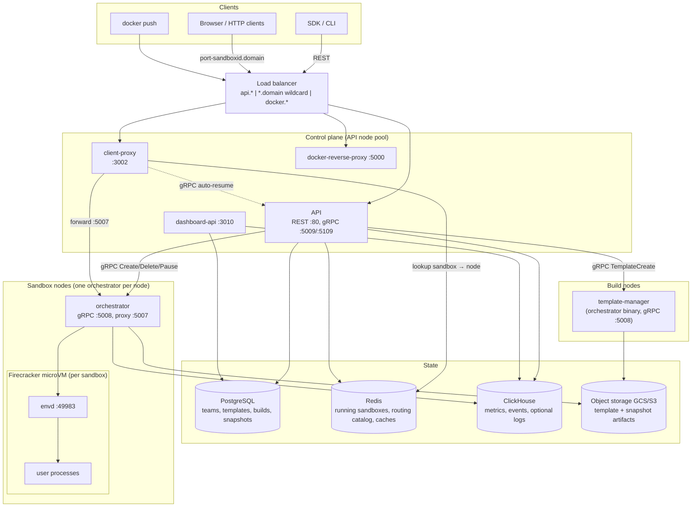
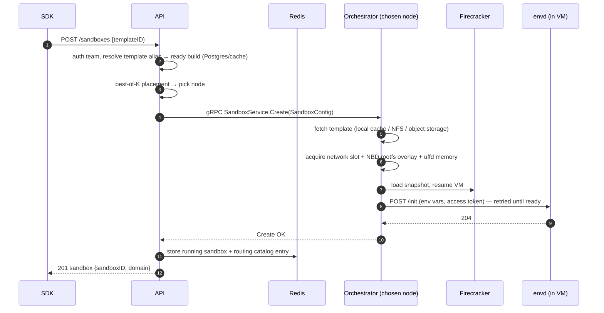
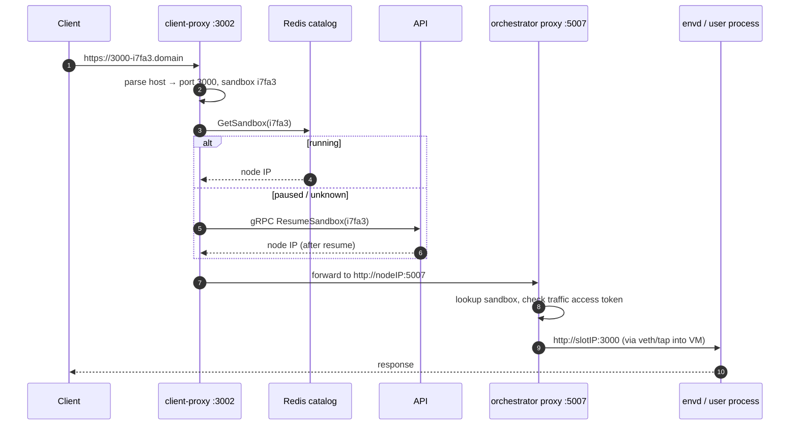
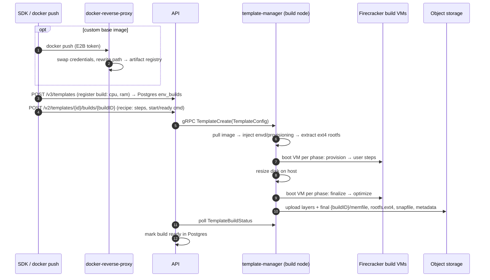
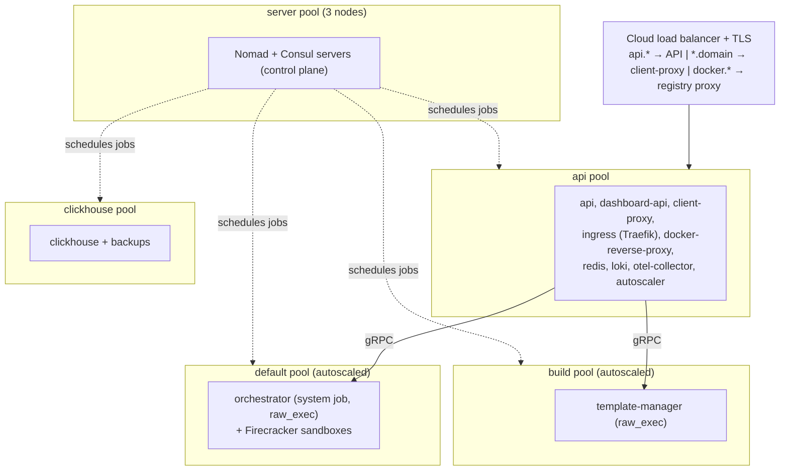

# E2B Infrastructure Architecture

This document explains what this repository implements, what each service does, and how the
services interact. It is the fastest way to build a mental model of the codebase before diving
into the code.

> **Keep this document updated.** If a code change alters anything described here (service
> responsibilities, ports, protocols, data stores, flows, deployment topology), update this file
> in the same PR.

## What this repository implements

E2B provides **sandboxes**: isolated Linux VMs that start almost instantly (they resume pre-booted
snapshots instead of cold-booting), run arbitrary code (typically
generated by AI agents), and can be paused, snapshotted, and resumed. This repo contains the whole
backend: the control-plane REST API, the data-plane VM orchestration built on
**Firecracker microVMs**, the in-VM agent, the edge routing layer, template building, and the
Terraform/Nomad infrastructure to deploy it all on GCP (AWS in beta).

Two ideas drive the design:

1. **A sandbox is a resumed snapshot.** Templates are pre-booted VM snapshots (memory + disk +
   VM state) stored in object storage. "Creating" a sandbox means restoring a snapshot, which is
   why startup is fast. Memory pages are loaded lazily on page-fault (userfaultfd) and the root
   filesystem is a copy-on-write overlay, so only touched data is ever fetched.
2. **Control plane and data plane are separate.** The API decides *where* a sandbox runs and
   tracks *that* it runs (Postgres/Redis); the orchestrator on each node owns *how* it runs
   (Firecracker, networking, storage). Sandbox traffic never passes through the API.

## System overview



## Services

| Service | Package | Runs on | Purpose |
|---|---|---|---|
| API | `packages/api` | API nodes | Public REST API; sandbox lifecycle, placement, auth, quotas |
| Orchestrator | `packages/orchestrator` | every sandbox node | Runs Firecracker VMs; sandbox create/pause/resume/kill |
| Template manager | `packages/orchestrator` (role) | build nodes | Builds templates from Docker images |
| Client proxy | `packages/client-proxy` | API nodes | Edge router: sandbox URL → correct node |
| Envd | `packages/envd` | inside every VM | In-VM agent: process/filesystem API for SDKs |
| Dashboard API | `packages/dashboard-api` | API nodes | Backend for the web dashboard (teams, builds, admin) |
| Docker reverse proxy | `packages/docker-reverse-proxy` | API nodes | Registry auth gateway for pushing template images |

Supporting packages: `packages/shared` (protos, telemetry, storage clients, feature flags),
`packages/auth` (authentication library), `packages/db` (Postgres migrations + sqlc queries),
`packages/clickhouse` (ClickHouse schema + clients), `packages/otel-collector` (collector config),
`packages/nomad-nodepool-apm` (autoscaler plugin), `packages/local-dev` (local stack).

### API (`packages/api`)

The control-plane entry point (Gin, OpenAPI-generated from `spec/openapi.yml`, port 80).

- **Resources**: sandboxes (create/list/kill/pause/resume/connect/timeout/metrics/logs),
  templates and builds, teams, volumes, API keys/access tokens, admin operations.
- **Auth** (via `packages/auth`): team API keys (`X-API-Key`, `e2b_` prefix), auth-provider JWTs
  (OIDC), admin token. Backed by an auth DB (Postgres) with a Redis team cache.
- **Workload identity**: sandbox create accepts an optional `iam.tokens` map of caller-named
  workload-token definitions (each an exact `audience` and `tokenType`). A non-empty, validated
  map enables workload identity, whose identity the orchestrator derives from the sandbox's
  already-authoritative team/sandbox/execution/template IDs; the definitions are passed to the
  orchestrator in `SandboxConfig.iam`. The API mints no credential and delivers nothing into the
  sandbox; file-based delivery is rejected at admission. Definitions are persisted in the
  running-sandbox (Redis) and paused-snapshot (Postgres) state so they survive pause/resume and
  orchestrator re-sync; a fork starts a new workload and does not inherit them.
- **Placement**: keeps a live map of orchestrator nodes (discovered via Nomad, Kubernetes, or a
  static list). Chooses a node per sandbox with a **best-of-K** algorithm
  (`internal/orchestrator/placement/`): sample K ready nodes, score by CPU
  commitment/usage, pick the lowest; retry on exhausted nodes. Tunable live via feature flags.
- **State**: writes sandbox records to Redis (source of truth for *running* sandboxes) and the
  sandbox→node **routing catalog** in Redis that client-proxy reads. Persistent entities
  (templates, builds, snapshots, teams) live in Postgres.
- **Extra listeners**: internal gRPC :5009 and edge gRPC :5109 expose `ResumeSandbox` so
  client-proxy can wake paused sandboxes on incoming traffic.
- Reads ClickHouse for sandbox/team metrics endpoints. Sandbox and template-build logs default to
  Loki; `logs-read-config` independently enables the ClickHouse read path for local-cluster logs
  during the log storage migration. LaunchDarkly feature flags also gate placement parameters,
  rate limits, and rollouts.

### Orchestrator (`packages/orchestrator`)

A single Go binary running on every sandbox node (as root). `ORCHESTRATOR_SERVICES` selects its
roles: `orchestrator` (run sandboxes) and/or `template-manager` (build templates). Code lives
under `pkg/`, almost all Linux-only.

gRPC services on :5008 (`pkg/server/`, `pkg/service/`, `pkg/template/server/`, `pkg/volumes/`):

- **SandboxService** — `Create`, `Update`, `List`, `Delete`, `Pause`, `Checkpoint`.
- **TemplateService** — `TemplateCreate`, `TemplateBuildStatus`, `TemplateBuildDelete` (template-manager role only).
- **InfoService** — node identity, roles, capacity, health status (used by API node discovery).
- **ChunkService / VolumeService** — peer-to-peer template chunk serving; persistent volumes.

Key mechanisms (all under `pkg/sandbox/`):

- **Firecracker** (`fc/`): each sandbox is one Firecracker process in its own cgroup and network
  namespace. The FC HTTP API (unix socket) configures machine, drives, network, and snapshots.
  Guest metadata (sandbox ID, envd access token hash) is passed via MMDS.
- **Lazy memory / UFFD** (`uffd/`): on resume, Firecracker restores the VM without loading
  memory; a userfaultfd handler serves page faults directly from the template's memfile, so only
  touched pages are read. An optional prefetcher warms known-hot pages.
- **Copy-on-write rootfs** (`rootfs/`, `nbd/`, `block/`): the template rootfs stays read-only;
  writes go to a per-sandbox COW cache exposed to Firecracker as an NBD block device served by
  an in-process userspace NBD server. On pause, the dirty blocks are exported as a diff.
- **Template cache** (`template/`): templates are fetched lazily from object storage and cached
  on local disk (and optionally on a shared NFS chunk cache, or fetched peer-to-peer from other
  nodes before upload completes).
- **Networking** (`network/`): each sandbox gets a slot — a network namespace with a veth pair
  and a tap device, unique host-side IP (from a /16), NAT, and per-slot nftables egress firewall
  (with SNI/Host-inspecting TCP firewall for domain allow/deny lists). Slots are pooled and
  reused; slot allocation is coordinated through Consul KV.
- **Sandbox proxy** (:5007, `pkg/proxy/`): reverse-proxies incoming traffic from client-proxy to
  the sandbox's slot IP and requested port, enforcing per-sandbox traffic access tokens.
- Writes sandbox lifecycle **events** and cgroup **host stats** to ClickHouse; exports metrics via
  OTel. Sandbox and template-build logs always use the fixed Vector HTTP collector. Enabling the
  boolean `logs-dual-write` LaunchDarkly flag additionally sends each application log through the
  application's OTel provider during rollout.

### Envd (`packages/envd`)

The agent inside every VM (started by systemd very early in boot), port 49983, chi + Connect RPC.

- **Process service** (`spec/process/process.proto`): start/list/connect to processes, stream
  stdout/stderr, stdin, signals, PTYs — this is what SDKs use to "run code".
- **Filesystem service** (`spec/filesystem/filesystem.proto`): stat/list/make/move/remove/watch.
- **REST**: `/health`, `/metrics`, `/files` upload/download, `/init` (orchestrator pushes env
  vars, access token, metadata after boot/resume), freeze/thaw hooks used during pause.
- **Auth**: `X-Access-Token` header checked against a token delivered via Firecracker MMDS;
  signed URLs for file endpoints.
- Scans guest ports and forwards them so any port a user process opens becomes reachable through
  sandbox URLs. **`pkg/version.go` must be bumped on every behavioral change** — the API and the
  orchestrator gate features on the envd version recorded in each template build.

### Client proxy (`packages/client-proxy`)

The stateless edge for all sandbox traffic (port 3002; health on 3003). Terminates
`https://<port>-<sandboxID>.<domain>` requests (host parsing in `packages/shared/pkg/proxy/host.go`),
looks the sandbox up in the Redis routing catalog to find the owning node, and reverse-proxies to
that node's orchestrator proxy on :5007. If the sandbox is not in the catalog (paused), it calls
the API's `ResumeSandbox` gRPC and retries — paused sandboxes wake transparently on traffic.

### Dashboard API (`packages/dashboard-api`)

A separate REST service (port 3010, spec `spec/openapi-dashboard.yml`) consumed by the web
dashboard, not the SDK: team management/provisioning, template tags, build listings, admin
bootstrap. Team-scoped template and build read routes accept either dashboard user auth or
team API key auth (`X-API-Key`). Its workspace-agnostic `/v1/management` operations are defined in the
same dashboard OpenAPI contract and registered on the existing router. Their `AdminJWTAuth`
OpenAPI security scheme accepts only short-lived service JWTs verified against the workspace-api
`/.well-known/jwks.json` endpoint, with accepted signing methods derived from each JWK's required
`alg` metadata. Issuers and audiences are configured through the JSON `ADMIN_AUTH_PROVIDER_CONFIG` value —
the same config shape as `AUTH_PROVIDER_CONFIG`. Talks to Postgres and ClickHouse; never talks to
orchestrators.

### Docker reverse proxy (`packages/docker-reverse-proxy`)

A Docker Registry v2 auth gateway (port 5000). Users `docker push` template base images with E2B
credentials; the proxy validates them, swaps in real registry credentials, and rewrites paths
into the cloud artifact registry (`/v2/e2b/custom-envs/<templateID>` → project registry).

## Data stores

| Store | Owner packages | What lives there |
|---|---|---|
| **PostgreSQL** | `packages/db` (goose migrations, sqlc) | Durable control-plane state: `teams`, `users`, `tiers` (quotas), `envs` (templates), `env_builds` (build rows: vcpu, ram_mb, status, versions), `env_aliases`, `snapshots` (paused sandboxes), `team_api_keys`, `access_tokens`, `volumes`, `clusters` |
| **Redis** | API, client-proxy, orchestrator | Ephemeral runtime state: running-sandbox store (source of truth), sandbox→node routing catalog, team/template/snapshot caches, rate limiting, P2P chunk peer registry |
| **ClickHouse** | `packages/clickhouse` | Time-series/analytics: `metrics_gauge`/`metrics_sum` (written by the OTel collector), `sandbox_events`, `sandbox_host_stats` (written by orchestrator), team metrics, and optionally `sandbox_logs` during the log migration. Read by API and dashboard-api |
| **Object storage** (GCS/S3/local, `packages/shared/pkg/storage`) | orchestrator, template-manager | Template & snapshot artifacts, keyed by build ID: `{buildID}/memfile`, `{buildID}/rootfs.ext4`, `{buildID}/snapfile`, `{buildID}/metadata.json` + `.header` index files |
| **Consul KV** | orchestrator | Network slot allocation across restarts |

A template and a paused-sandbox snapshot have the **same artifact shape** — a snapshot is just a
new build whose memfile/rootfs are stored as diffs against the template it came from (diff chains
are resolved through the `.header` files).

## Core flows

### Sandbox creation



The API blocks on the gRPC `Create`, which itself blocks on envd's `/init` — when the client
gets a response, the sandbox is fully usable. Fresh creates are internally a *resume* of the
template's base snapshot (cold boots only happen for filesystem-only templates and builds).

### Sandbox traffic



### Pause and resume

- **Pause**: API records a snapshot row in Postgres, then gRPC `Pause` to the node. The
  orchestrator pauses the VM, snapshots it, diffs memory (dirty-page tracking) and rootfs (COW
  cache) against the template, caches the snapshot locally, and uploads asynchronously to object
  storage (with a retry budget). The sandbox leaves the Redis catalog.
- **Resume**: same path as creation, but placement prefers the **origin node** — if the snapshot
  is still in its local cache, resume avoids any object-storage reads. `Checkpoint` is a
  pause+resume in place used to persist state while keeping the sandbox running.
- Auto-pause/auto-resume make sandboxes effectively serverless: idle sandboxes pause, traffic
  resumes them (see traffic flow above).

### Template build



Builds are **layered** (`pkg/template/build/phases/`): base → user → one layer per recipe step →
resize disk → finalize → optimize. Each layer is hashed and cached, so rebuilds only re-run changed
steps. Resize disk grows the quiescent rootfs on the host; the other non-cached phases run in a real
Firecracker VM and their pause-diffs become layers. The optimize phase records which memory pages a
fresh resume touches, producing prefetch hints that speed up future sandbox starts.

## Deployment topology

Deployed with **Terraform** (`iac/provider-gcp/`, `iac/provider-aws/`) onto a **Nomad + Consul**
cluster. Nomad job specs live in `iac/modules/job-*/jobs/*.hcl`.



- **Server nodes** run only Nomad/Consul servers (scheduling, service discovery, Consul DNS —
  services address each other as `*.service.consul`).
- **API nodes** host every control-plane container and are the only LB backend.
- **Sandbox ("client") nodes** run the orchestrator as a Nomad *system* job via `raw_exec`
  (it needs root for Firecracker, namespaces, NBD, cgroups). Configured with hugepages and local
  template caches. Autoscaled.
- **Build nodes** run the same binary in template-manager mode; the `nomad-nodepool-apm`
  autoscaler plugin scales the job with the node pool.
- PostgreSQL is external (connection string via secrets); Redis runs as a Nomad job or as a
  managed service; ClickHouse runs on its own pool.
- Observability: everything exports OTel; the collector fans out to ClickHouse (product metrics)
  and Grafana Cloud/stack. Logs use the legacy Vector → Loki HTTP path; `logs-dual-write` adds an
  OTLP copy, while local-cluster log reads can independently be switched to ClickHouse with
  `logs-read-config` after `sandbox_logs` is populated.

## Repository layout

```
packages/
  api/                  Control-plane REST API
  orchestrator/         Sandbox runtime + template builder (one binary, per-node)
  client-proxy/         Edge router for sandbox traffic
  envd/                 In-VM agent (bump pkg/version.go on behavior change!)
  dashboard-api/        Web-dashboard backend
  docker-reverse-proxy/ Registry auth gateway for template images
  shared/               Protos, telemetry, storage clients, proxy engine, feature flags
  auth/                 AuthN library (API keys, JWT/OIDC) used by api + dashboard-api
  db/                   Postgres migrations (goose) + queries (sqlc)
  clickhouse/           ClickHouse schema, batching writers, query clients
  otel-collector/       Collector config
  nomad-nodepool-apm/   Nomad autoscaler metric and deployment-aware target plugins
  local-dev/            docker-compose local stack + DB seeding
spec/                   OpenAPI specs (public, edge, dashboard) — codegen sources
iac/                    Terraform + Nomad jobs (provider-gcp, provider-aws, shared modules)
tests/integration/      Integration tests against a live deployment
```

Cross-service contracts are all generated: OpenAPI specs in `spec/`, gRPC protos in
`packages/orchestrator/*.proto` and `packages/envd/spec/`, SQL in `packages/db/queries/`.
Run `make generate` after changing any of them.
