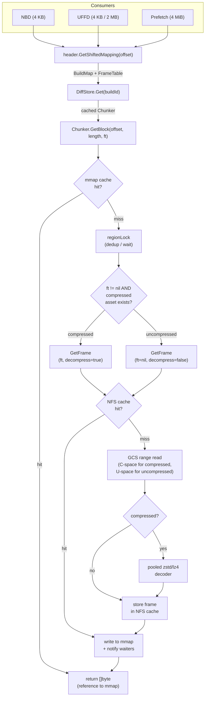

# Template Compression: Architecture & Status

## A. Current Architecture

Templates are stored in GCS as build artifacts. Each build produces two data files (memfile, rootfs) plus a header and metadata. With compression enabled, each data file can have an uncompressed variant (`{buildId}/memfile`) and a compressed variant (`{buildId}/v4.memfile.lz4`) side-by-side, with corresponding v3 (uncompressed) and v4 (compressed) headers.

### Storage Format

- Data is broken into **frames**, each independently decompressible (LZ4 or Zstd).
- Frames are aligned to `FrameAlignmentSize` (= `MemoryChunkSize` = 4 MiB) in uncompressed space, with a minimum of 1 MB compressed and a maximum of 32 MB uncompressed (configurable).
- The **v4 header** embeds a `FrameTable` per mapping: `CompressionType + StartAt + []FrameSize`. The header itself is always LZ4-block-compressed, regardless of data compression type.
- The `FrameTable` is subset per mapping so each mapping carries only the frames it references.

### Storage Layer

The storage layer is a decorator stack:

```
Callers → InstrumentedProvider → Cache (NFS) → Storage → InstrumentedBackend → GCP/AWS/FS
```

- `StorageProvider` is the main interface (`FrameGetter + FileStorer + Blobber + PublicUploader + Manager`).
- `Cache` wraps `StorageProvider` for NFS read-through caching. For compressed data, frames are cached individually on NFS by `(path, frameStart, frameSize)` key.
- `InstrumentedProvider` / `InstrumentedBackend` add OTEL spans and timing metrics at the provider and backend layers respectively.

### Feature Flags

Two LaunchDarkly JSON flags control compression, with per-team/cluster/template targeting:

| Flag | Path | Controls |
|------|------|----------|
| `compress-config` | Write | `compressBuilds` (bool): whether builds produce compressed artifacts |
| `chunker-config` | Read | `useCompressedAssets` (bool): whether the orchestrator loads v4 headers and reads compressed data; `minReadBatchSizeKB` (int): progressive delivery batch size |

### Template Loading (Cold Path)

When an orchestrator loads a template from storage (cache miss):

1. **Header probe**: if `useCompressedAssets`, probes for v4 and v3 headers in parallel, preferring v4. Falls back to v3 if v4 is missing.
2. **Asset probe**: for each build referenced in header mappings, probes for 3 data variants in parallel (uncompressed, `.lz4`, `.zstd`). Missing variants are silently skipped.
3. **Chunker creation**: one `Chunker` per `(buildId, fileType)`, cached in `DiffStore` with TTL. The chunker's `AssetInfo` records which variants exist.

### Template Loading (Hot Path)

When pausing and resuming on the same orchestrator, headers are computed in memory and diffs are pre-seeded in the `DiffStore`. No GCS reads occur for the header or data probe.

### Read Path (NBD / UFFD / Prefetch)

All three consumer types share the same path at read time:

```
GetBlock(offset, length, ft)
  → header.GetShiftedMapping(offset)    // in-memory → BuildMap with FrameTable
  → DiffStore.Get(buildId)              // TTL cache hit → cached Chunker
  → Chunker.GetBlock(offset, length, ft)
      → mmap cache hit? return reference
      → miss: regionLock dedup → fetchSession → GetFrame → NFS cache → GCS
      → decompressed bytes written into mmap, waiters notified
```

- Prefetch reads 4 MiB, UFFD reads 4 KB or 2 MB (hugepage), NBD reads 4 KB.
- If the v4 header was loaded, each mapping carries a subset `FrameTable`; this `ft` is threaded through to `GetBlock`, routing to compressed or uncompressed fetch.

---

## B. Major Changes (This Branch)

- **Unified Chunker**: collapsed `FullFetchChunker`, `StreamingChunker`, and the `Chunker` interface into a single concrete `Chunker` struct backed by slot-based `regionLock` for fetch deduplication; a single code path handles both compressed and uncompressed data via `GetFrame`.

- **Asset probing at init**: `StorageDiff.Init` now probes for all 3 data variants (uncompressed, lz4, zstd) in parallel via `probeAssets`, constructing an `AssetInfo` that the Chunker uses to route reads. This replaces the previous `OpenSeekable` single-object path.

- **Upload API on TemplateBuild**: moved the upload lifecycle from `Snapshot` to `TemplateBuild`, which now owns path extraction, `PendingFrameTables` accumulation, and V4 header serialization. `UploadAll` is synchronous (no internal goroutine); multi-layer builds use `UploadExceptV4Headers` + `UploadV4Header` with explicit coordination via `UploadTracker`.

- **NFS cache for compressed frames**: `GetFrame` on the NFS cache layer stores and retrieves individual compressed frames by `(path, frameStart, frameSize)`, with progressive decompression into mmap. Uncompressed reads use the same `GetFrame` codepath with `ft=nil`.

- **FrameTable validation and testing**: added `validateGetFrameParams` at the `GetFrame` entry point (alignment checks for compressed, bounds checks for uncompressed), fixed `FrameTable.Range` bug (was not initializing from `StartAt`), and added comprehensive `FrameTable` unit tests.

---

## C. Read Path Diagram



<details>
<summary>ASCII version</summary>

```
  NBD (4KB)    UFFD (4KB/2MB)    Prefetch (4MiB)
      \              |               /
       `---------.---'--------.-----'
                 v            v
    header.GetShiftedMapping(offset)
                 |
                 v
         DiffStore.Get(buildId) ──> cached Chunker
                 |
                 v
    Chunker.GetBlock(offset, length, ft)
                 |
          .------+------.
          v             v
    [mmap hit]    [mmap miss]
     return ref        |
                 regionLock (dedup/wait)
                       |
              .--------+--------.
              v                 v
        ft != nil?          ft == nil
        compressed          uncompressed
        asset exists?
              |                 |
              v                 v
         GetFrame           GetFrame
       (decompress=T)     (decompress=F)
              |                 |
              '--------+-------'
                       |
                 NFS cache hit? ──yes──> write to mmap
                       |                 + notify waiters
                      no                      |
                       |                      v
                 GCS range read          return []byte ref
                 (C-space / U-space)
                       |
                 compressed? ──no──> store in NFS
                       |                   |
                      yes                  v
                       |            write to mmap
                 zstd/lz4 decode    + notify waiters
                       |                   |
                 store in NFS              v
                       |            return []byte ref
                       v
                 write to mmap
                 + notify waiters
                       |
                       v
                 return []byte ref
```

</details>

---

## D. Remaining Work

### From This Branch

1. **Verify `getFrame` timer lifecycle** (TODO #2): audit that `Success()`/`Failure()` is always called on every code path in the storage cache's `getFrameCompressed` and `getFrameUncompressed`. Check for timer leaks on panics or early returns.

2. **NFS cache for `GetFrame` is passthrough** (TODO #5): currently `cache.GetFrame` delegates directly to `c.inner.GetFrame`. A read-through NFS caching layer for `GetFrame` (similar to how `OpenRangeReader` had it) would restore the NFS benefit. Acceptable for now since compressed is the target state and compressed frames are NFS-cached in `getFrameCompressed`, but uncompressed `GetFrame` calls bypass NFS.

### From `lev-zstd-compression` (Unported)

3. **OTEL instrumentation middleware** (`instrumented_provider.go`, `instrumented_backend.go`): full span and metrics wrapping for the entire storage layer. Production-grade observability for debugging compression issues. ~400 lines.

4. **Chunker test suite** (`chunk_test.go`): ~1800 lines of matrix tests covering LRU population, concurrent access, decompression stats, cross-chunker coverage. Essential for regression safety.

5. **LRU cache for decompressed frames** (`frame_lru.go`, `chunk_compress_lru.go`, `chunk_compress_mmap_lru.go`): in-memory LRU (hashicorp/golang-lru) with singleflight dedup to avoid re-decompression when adjacent pages fault into the same frame. Two variants: LRU-only and two-level (LRU + mmap).

6. **CLI tools** (`compress-build`, `show-build-diff`, `inspect-build`): operational tools for compressing existing builds, inspecting headers, and comparing build diffs. `compress-build --recursive` walks dependency graphs. Already in the branch, partially ported.

7. **Storage-layer retry client** (`retriable_client.go`): configurable retry with full-jitter exponential backoff (AWS pattern), OTEL-instrumented HTTP transport.

8. **Compression test coverage** (`compress_test.go`, `storage_cache_seekable_test.go`, `template_build_test.go`): ~2500 lines of tests for compressed uploads, frame table serialization, cache behavior with compressed data, and feature flag integration.

---

## E. Write Paths

### Inline Build / Pause (Hot Path)

Triggered by `sbx.Pause()` or initial template build. The orchestrator creates a `Snapshot` (FC memory + rootfs diffs, headers, snapfile, metadata), then constructs a `TemplateBuild` which owns the upload lifecycle:

- **Single-layer** (initial build, simple pause): `TemplateBuild.UploadAll(ctx)` — synchronous, creates its own `PendingFrameTables` internally. Uploads uncompressed data + compressed data (if `compressBuilds` FF enabled) + uncompressed headers + snapfile + metadata concurrently in an errgroup. V4 headers are finalized and uploaded after all data uploads complete (they depend on `FrameTable` results).

- **Multi-layer** (layered build): `TemplateBuild.UploadExceptV4Headers(ctx)` uploads all data, then returns `hasCompressed`. The caller coordinates with `UploadTracker` to wait for ancestor layers, then calls `TemplateBuild.UploadV4Header(ctx)` which reads accumulated `PendingFrameTables` from all layers and serializes the final v4 header.

### Background Compression (`compress-build` CLI)

A standalone CLI tool for compressing existing uncompressed builds after the fact:

```
compress-build -build <uuid> [-storage gs://bucket] [-compression lz4|zstd] [-recursive]
```

- Reads the uncompressed data from GCS, compresses into frames, writes compressed data + v4 header back.
- `--recursive` walks header mappings to discover and compress dependency builds first (parent templates), avoiding nil-FrameTable gaps in derived templates.
- Supports `--dry-run`, `-template <alias>` (resolves via E2B API), configurable frame size and compression level.
- Idempotent: skips builds that already have compressed artifacts.

---

## F. Grafana Metrics

Each `TimerFactory` metric emits three series with the same name but different units: a duration histogram (ms), a bytes counter (By), and an ops counter. All three carry the same attributes listed below plus an automatic `result` = `success` | `failure`.

### Chunker (meter: `internal.sandbox.block.metrics`)

| Metric | What it measures | Attributes |
|--------|-----------------|------------|
| `orchestrator.blocks.slices` | End-to-end `GetBlock` latency (mmap hit or remote fetch) | `compressed` (bool), `pull-type` (`local` · `remote`), `failure-reason`\* |
| `orchestrator.blocks.chunks.fetch` | Remote storage fetch (GCS range read + optional decompress) | `compressed` (bool), `failure-reason`\* |
| `orchestrator.blocks.chunks.store` | Writing fetched data into local mmap cache | — |

\* `failure-reason` values: `local-read`, `local-read-again`, `remote-read`, `cache-fetch`, `session_create`

### NFS Cache (meter: `shared.pkg.storage`)

| Metric | What it measures | Attributes |
|--------|-----------------|------------|
| `orchestrator.storage.slab.nfs.read` | NFS cache read (frame or size lookup) | `operation` (`GetFrame` · `Size`) |
| `orchestrator.storage.slab.nfs.write` | NFS cache write (store frame after GCS fetch) | — |
| `orchestrator.storage.cache.ops` | NFS cache operation count | `cache_type` (`blob` · `framed_file`), `op_type`\*, `cache_hit` (bool) |
| `orchestrator.storage.cache.bytes` | NFS cache bytes transferred | `cache_type`, `op_type`\*, `cache_hit` (bool) |
| `orchestrator.storage.cache.errors` | NFS cache errors (excluding expected `ErrNotExist`) | `cache_type`, `op_type`\*, `error_type` (`read` · `write` · `write-lock`) |

\* `op_type` values: `get_frame`, `write_to`, `size`, `put`, `store_file`

### GCS Backend (meter: `shared.pkg.storage`)

| Metric | What it measures | Attributes |
|--------|-----------------|------------|
| `orchestrator.storage.gcs.read` | GCS read operations | `operation` (`Size` · `WriteTo` · `GetFrame`) |
| `orchestrator.storage.gcs.write` | GCS write operations | `operation` (`Write` · `WriteFromFileSystem` · `WriteFromFileSystemOneShot`) |

### Key Queries

- **Compressed vs uncompressed latency**: `orchestrator.blocks.slices` grouped by `compressed`, filtered to `result=success`
- **Cache hit rate**: `orchestrator.blocks.slices` where `pull-type=local` vs `pull-type=remote`
- **NFS effectiveness**: `orchestrator.storage.cache.ops` where `op_type=get_frame`, ratio of `cache_hit=true` to total
- **GCS fetch volume**: `orchestrator.storage.gcs.read` where `operation=GetFrame`, bytes counter
- **Decompression overhead**: `orchestrator.blocks.chunks.fetch` where `compressed=true`, compare duration histogram to `compressed=false`

---

## G. Rollout Strategy

_TBD_
