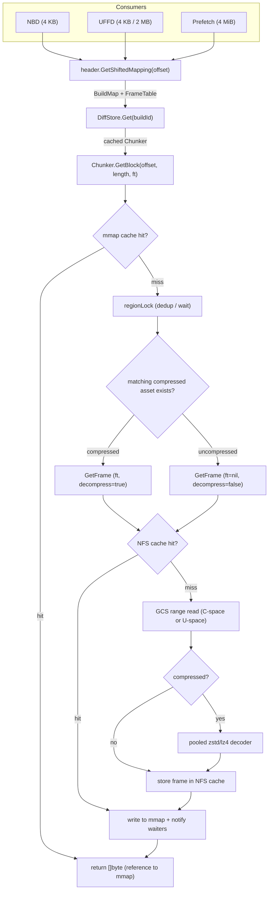

# Template Compression: Architecture & Status

## A. Current Architecture

Templates are stored in GCS as build artifacts. Each build produces two data files (memfile, rootfs) plus a header and metadata. With compression enabled, each data file can have an uncompressed variant (`{buildId}/memfile`) and a compressed variant (`{buildId}/v4.memfile.lz4`) side-by-side, with corresponding v3 (uncompressed) and v4 (compressed) headers.

### Storage Format

- Data is broken into **frames**, each independently decompressible (LZ4 or Zstd).
- Frames are aligned to `FrameAlignmentSize` (= `MemoryChunkSize` = 4 MiB) in uncompressed space, with a minimum of 1 MB compressed and a maximum of 32 MB uncompressed (configurable).
- The **v4 header** embeds a `FrameTable` per mapping: `CompressionType + StartAt + []FrameSize`. The header itself is always LZ4-block-compressed, regardless of data compression type.
- The `FrameTable` is subset per mapping so each mapping carries only the frames it references.

### Storage interface

The most relevant change is `FramedFile` (returned by `OpenFramedFile`) replaces the old `Seekable` (returned by `OpenSeekable`). Where `Seekable` had separate `ReadAt`, `OpenRangeReader`, and `StoreFile` methods, `FramedFile` unifies reads into a single `GetFrame(ctx, offsetU, frameTable, decompress, buf, readSize, onRead)` that handles both compressed and uncompressed data, plus `Size` and `StoreFile` (with optional compression via `FramedUploadOptions`). For compressed data, raw compressed frames are cached individually on NFS by `(path, frameStart, frameSize)` key.

### Feature Flags

Two LaunchDarkly JSON flags control compression, with per-team/cluster/template targeting:

**`chunker-config`** (read path):

```json
// (restart required for existing chunkers)
{
  "useCompressedAssets": false,   // load v4 headers, use compressed read path if available
  "minReadBatchSizeKB": 16        // floor for read batch size in KB 
}
```

**`compress-config`** (write path):

```json
{
  "compressBuilds": false,         // enable compressed dual-write uploads
  "compressionType": "zstd",       // "lz4" or "zstd"
  "level": 2,                      // compression level (0=fast, higher=better ratio)
  "frameTargetMB": 2,              // target compressed frame size in MiB
  "frameMaxUncompressedMB": 16,    // cap on uncompressed bytes per frame (= 4 × MemoryChunkSize)
  "uploadPartTargetMB": 50,        // target GCS multipart upload part size in MiB
  "encoderConcurrency": 1,         // goroutines per zstd encoder
  "decoderConcurrency": 1          // goroutines per pooled zstd decoder
}
```

### Template Loading

When an orchestrator loads a template from storage (cache miss):

1. **Header probe**: if `useCompressedAssets`, probes for v4 and v3 headers in parallel, preferring v4. Falls back to v3 if v4 is missing.
2. **Asset probe**: for each build referenced in header mappings, probes for 3 data variants in parallel (uncompressed, `.lz4`, `.zstd`). Missing variants are silently skipped. This allows supporting serving across compressed/uncompressed-only assets.
3. **Chunker creation**: one `Chunker` per `(buildId, fileType)`. The chunker's `AssetInfo` records which variants exist.

### Read Path (NBD / UFFD / Prefetch)

All three consumer types share the same path at read time:

```
GetBlock(offset, length, ft) // was Slice()
  → header.GetShiftedMapping(offset)    // in-memory → BuildMap with FrameTable
  → DiffStore.Get(buildId)              // TTL cache hit → cached Chunker
  → Chunker.GetBlock(offset, length, ft)
      → mmap cache hit? return reference
      → miss: regionLock dedup → fetchSession → GetFrame → NFS cache → GCS
      → decompressed bytes written into mmap, waiters notified
```

- Prefetch reads 4 MiB, UFFD reads 4 KB or 2 MB (hugepage), NBD reads 4 KB.
- Compressed frames are composed of chunks aligned to `MemoryChunkSize` (4 MiB) — the maximum of the three consumer sizes. This guarantees no `GetBlock` call ever crosses a frame boundary.
- If the v4 header was loaded, each mapping carries a subset `FrameTable`; this `ft` is threaded through to `GetBlock`, routing to compressed or uncompressed fetch, no header fetch is needed.

---

## B. Major Changes (This Branch)

- **Unified Chunker**: collapsed `FullFetchChunker`, `StreamingChunker`, and the `Chunker` interface back into a single concrete `Chunker` struct backed by slot-based `regionLock` for fetch deduplication; a single code path handles both compressed and uncompressed data via `GetFrame`.

- **Asset probing at init**: `StorageDiff.Init` now probes for all 3 data variants (uncompressed, lz4, zstd) in parallel via `probeAssets`, constructing an `AssetInfo` that the Chunker uses to route reads. This replaces the previous `OpenSeekable` single-object path.

- **Upload API on TemplateBuild**: moved the upload lifecycle from `Snapshot` to `TemplateBuild`, which now owns path extraction, `PendingFrameTables` accumulation, and V4 header serialization. `UploadAll` is synchronous (no internal goroutine); multi-layer builds use `UploadExceptV4Headers` + `UploadV4Header` with explicit coordination via `UploadTracker`.

- **NFS cache for compressed frames**: `GetFrame` on the NFS cache layer stores and retrieves individual compressed frames by `(path, frameStart, frameSize)`, with progressive decompression into mmap. Uncompressed reads use the same `GetFrame` codepath with `ft=nil`.

- **FrameTable validation and testing**: added `validateGetFrameParams` at the `GetFrame` entry point (alignment checks for compressed, bounds checks for uncompressed), fixed `FrameTable.Range` bug (was not initializing from `StartAt`), and added comprehensive `FrameTable` unit tests.

---

## C. Read Path Diagram



<details>
<summary>ASCII version</summary>

```
  NBD (4KB)    UFFD (4KB/2MB)    Prefetch (4MiB)
      \              |               /
       `---------.---'--------.-----'
                 v            v
    header.GetShiftedMapping(offset)
                 |
                 v
         DiffStore.Get(buildId) ──> cached Chunker
                 |
                 v
    Chunker.GetBlock(offset, length, ft)
                 |
          .------+------.
          v             v
    [mmap hit]    [mmap miss]
     return ref        |
                 regionLock (dedup/wait)
                       |
              .--------+--------.
              v                 v
        ft != nil?          ft == nil
        compressed          uncompressed
        asset exists?
              |                 |
              v                 v
         GetFrame           GetFrame
       (decompress=T)     (decompress=F)
              |                 |
              '--------+-------'
                       |
                 NFS cache hit? ──yes──> write to mmap
                       |                 + notify waiters
                      no                      |
                       |                      v
                 GCS range read          return []byte ref
                 (C-space / U-space)
                       |
                 compressed? ──no──> store in NFS
                       |                   |
                      yes                  v
                       |            write to mmap
                 zstd/lz4 decode    + notify waiters
                       |                   |
                 store in NFS              v
                       |            return []byte ref
                       v
                 write to mmap
                 + notify waiters
                       |
                       v
                 return []byte ref
```

</details>

---

## D. Remaining Work

### From This Branch

1. **NFS cache passthrough for uncompressed `GetFrame`**: currently `cache.GetFrame` with `ft=nil` delegates directly to `c.inner.GetFrame` (no NFS caching). Compressed frames are NFS-cached in `getFrameCompressed`, but uncompressed `GetFrame` calls bypass NFS. Must fix for parity with main's uncompressed read path.

2. **Per-artifact compression config**: memfile and rootfs have very different compressibility profiles (memfile is mostly sparse/zero, rootfs is filesystem data). The `compress-config` flag should support separate codec, level, and frame size settings per artifact type rather than applying a single config to both.

3. **Verify `getFrame` timer lifecycle**: audit that `Success()`/`Failure()` is always called on every code path in the storage cache's `getFrameCompressed` and `getFrameUncompressed`. Check for timer leaks on panics or early returns.

### From `lev-zstd-compression` (Unported)

4. **Storage Provider/Backend layer separation**: decompose `StorageProvider` into distinct Provider (high-level: `FrameGetter`, `FileStorer`, `Blobber`) and Backend (low-level: `Basic`, `RangeGetter`, `MultipartUploaderFactory`) layers. Prerequisite for clean instrumentation wrapping.

5. **OTEL instrumentation middleware** (`instrumented_provider.go`, `instrumented_backend.go`): full span and metrics wrapping at both layers. Production-grade observability for debugging compression issues. ~400 lines.

6. **Test coverage** (~4300 lines total): chunker matrix tests (`chunk_test.go` — concurrent access, decompression stats, cross-chunker coverage), compression round-trip tests (`compress_test.go`), NFS cache with compressed data (`storage_cache_seekable_test.go`), template build upload tests (`template_build_test.go`), and auto-generated mocks (`MockStorageProvider`, `MockFeatureFlagsClient`).

---

## E. Write Paths

### Inline Build / Pause (Hot Path)

Triggered by `sbx.Pause()` or initial template build. The orchestrator creates a `Snapshot` (FC memory + rootfs diffs, headers, snapfile, metadata), then constructs a `TemplateBuild` which owns the upload lifecycle:

- **Single-layer** (initial build, simple pause): `TemplateBuild.UploadAll(ctx)` — synchronous, creates its own `PendingFrameTables` internally. Uploads uncompressed data + compressed data (if `compressBuilds` FF enabled) + uncompressed headers + snapfile + metadata concurrently in an errgroup. V4 headers are finalized and uploaded after all data uploads complete (they depend on `FrameTable` results).

- **Multi-layer** (layered build): `TemplateBuild.UploadExceptV4Headers(ctx)` uploads all data, then returns `hasCompressed`. The caller coordinates with `UploadTracker` to wait for ancestor layers, then calls `TemplateBuild.UploadV4Header(ctx)` which reads accumulated `PendingFrameTables` from all layers and serializes the final v4 header.

### Background Compression (`compress-build` CLI)

A standalone CLI tool for compressing existing uncompressed builds after the fact:

```
compress-build -build <uuid> [-storage gs://bucket] [-compression lz4|zstd] [-recursive]
```

- Reads the uncompressed data from GCS, compresses into frames, writes compressed data + v4 header back.
- `--recursive` walks header mappings to discover and compress dependency builds first (parent templates), avoiding nil-FrameTable gaps in derived templates.
- Supports `--dry-run`, `-template <alias>` (resolves via E2B API), configurable frame size and compression level.
- Idempotent: skips builds that already have compressed artifacts.

---

## F. Failure Modes

**Corrupted compressed frame in GCS or NFS**: no automatic fallback to uncompressed today. The read fails, `GetBlock` returns an error, and the sandbox page-faults. Unresolved: should the Chunker retry with the uncompressed variant when decompression fails and `HasUncompressed` is true?

**Half-compressed builds** (some layers have v4 header + compressed data, ancestors don't): handled by design. `probeAssets` finds whichever variants exist per build; each Chunker routes independently. A v4 header with a nil FrameTable for an ancestor mapping falls through to uncompressed fetch for that mapping.

**NFS unavailable**: compressed frames that miss NFS go straight to GCS (existing behavior). Uncompressed reads currently bypass NFS entirely (see TODO #1). No circuit breaker — repeated NFS timeouts will add latency to every miss until the cache recovers.

**Upload path complexity**: dual-write (uncompressed + compressed), `PendingFrameTables` accumulation, and V4 header serialization add failure surface to the build hot path. Multi-layer builds add `UploadTracker` coordination between layers. A compression failure during upload could fail the entire build. Back-out: set `compressBuilds: false` in `compress-config` — this disables compressed writes entirely; uncompressed uploads continue as before and the read path already handles missing compressed variants. No cleanup of already-written compressed data needed (it becomes inert).

### Unresolved

- Should Chunker fall back to uncompressed on a corrupt V4 header or  a decompression error?

---

## G. Cost & Benefit

### Storage

Sampled from `gs://e2b-staging-lev-fc-templates/` (262 builds, zstd level 2):

| Artifact | Builds sampled | Avg uncompressed | Avg compressed | Ratio |
|----------|---------------|-----------------|---------------|-------|
| memfile  | 191 (both variants) | 140 MiB | 35 MiB | **4.0x** |
| rootfs   | 153 (compressed-only) | unknown | varies | est. 2-10x (diff layers are tiny, full builds ~2x) |

With dual-write (transition period), GCS storage increases ~25% for memfile (compressed copy is 1/4 the size). After dropping uncompressed, net savings are **~75% for memfile**. Rootfs savings depend on the mix of diff vs full builds.

### CPU

New per-orchestrator CPU cost: decompressing every GCS-fetched frame. At ~35 MiB compressed per cold memfile load and zstd level 2 decode throughput of ~1-2 GB/s, each cold load burns ~20-40 ms of CPU. This scales with cold template load rate, not with sandbox count (mmap hits are free). Encode cost is on the write path only (build/pause), bounded by upload concurrency.

### Memory

The main cost: **mmap regions are allocated at uncompressed size** but frames are fetched whole. A 4 KB NBD read triggers a full frame fetch (4-16 MiB uncompressed), filling mmap with data the sandbox may never touch. This inflates RSS and can pressure the orchestrator fleet into scaling. Mitigations: tune `frameMaxUncompressedMB` down, or drop unrequested bytes from the mmap after the requesting read completes.

### Net

Smaller GCS reads (4x fewer bytes) and smaller NFS cache entries reduce network bandwidth. Upload path doubles bandwidth during dual-write transition. Overall, compression is net-positive on network cost once dual-write ends.

---

## H. Grafana Metrics

Each `TimerFactory` metric emits three series with the same name but different units: a duration histogram (ms), a bytes counter (By), and an ops counter. All three carry the same attributes listed below plus an automatic `result` = `success` | `failure`.

### Chunker (meter: `internal.sandbox.block.metrics`)

| Metric | What it measures | Attributes |
|--------|-----------------|------------|
| `orchestrator.blocks.slices` | End-to-end `GetBlock` latency (mmap hit or remote fetch) | `compressed` (bool), `pull-type` (`local` · `remote`), `failure-reason`\* |
| `orchestrator.blocks.chunks.fetch` | Remote storage fetch (GCS range read + optional decompress) | `compressed` (bool), `failure-reason`\* |
| `orchestrator.blocks.chunks.store` | Writing fetched data into local mmap cache | — |

\* `failure-reason` values: `local-read`, `local-read-again`, `remote-read`, `cache-fetch`, `session_create`

### NFS Cache (meter: `shared.pkg.storage`)

| Metric | What it measures | Attributes |
|--------|-----------------|------------|
| `orchestrator.storage.slab.nfs.read` | NFS cache read (frame or size lookup) | `operation` (`GetFrame` · `Size`) |
| `orchestrator.storage.slab.nfs.write` | NFS cache write (store frame after GCS fetch) | — |
| `orchestrator.storage.cache.ops` | NFS cache operation count | `cache_type` (`blob` · `framed_file`), `op_type`\*, `cache_hit` (bool) |
| `orchestrator.storage.cache.bytes` | NFS cache bytes transferred | `cache_type`, `op_type`\*, `cache_hit` (bool) |
| `orchestrator.storage.cache.errors` | NFS cache errors (excluding expected `ErrNotExist`) | `cache_type`, `op_type`\*, `error_type` (`read` · `write` · `write-lock`) |

\* `op_type` values: `get_frame`, `write_to`, `size`, `put`, `store_file`

### GCS Backend (meter: `shared.pkg.storage`)

| Metric | What it measures | Attributes |
|--------|-----------------|------------|
| `orchestrator.storage.gcs.read` | GCS read operations | `operation` (`Size` · `WriteTo` · `GetFrame`) |
| `orchestrator.storage.gcs.write` | GCS write operations | `operation` (`Write` · `WriteFromFileSystem` · `WriteFromFileSystemOneShot`) |

### Key Queries

- **Compressed vs uncompressed latency**: `orchestrator.blocks.slices` grouped by `compressed`, filtered to `result=success`
- **Cache hit rate**: `orchestrator.blocks.slices` where `pull-type=local` vs `pull-type=remote`
- **NFS effectiveness**: `orchestrator.storage.cache.ops` where `op_type=get_frame`, ratio of `cache_hit=true` to total
- **GCS fetch volume**: `orchestrator.storage.gcs.read` where `operation=GetFrame`, bytes counter
- **Decompression overhead**: `orchestrator.blocks.chunks.fetch` where `compressed=true`, compare duration histogram to `compressed=false`

---

## I. Rollout Strategy

_TBD_
