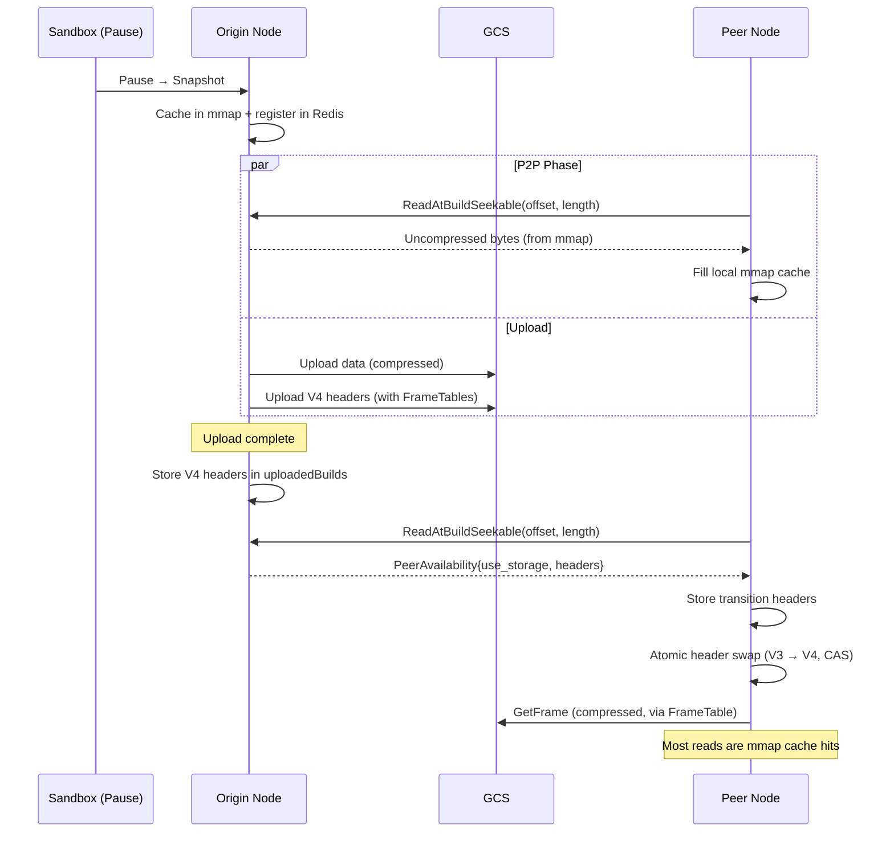

# Template Compression: Architecture

- [A. Architecture](#a-architecture)
  - [Storage Format](#storage-format) · [Storage Interface](#storage-interface) · [Feature Flags](#feature-flags) · [Template Loading](#template-loading) · [Read Path](#read-path-nbd--uffd--prefetch) · [NFS Caching](#nfs-caching)
- [B. Read Path Diagram](#b-read-path-diagram)
- [C. Write Paths](#c-write-paths)
  - [Inline Build / Pause](#inline-build--pause) · [Background Compression](#background-compression-compress-build-cli)
- [D. Peer-to-Peer Resume](#d-peer-to-peer-resume)
  - [Overview](#overview) · [Read Path During P2P](#read-path-during-p2p) · [Transition & Header Swap](#transition--header-swap) · [GetFrame Routing](#getframe-routing) · [Header States](#header-states) · [Invariants](#invariants)
- [E. Failure Modes](#e-failure-modes)
- [F. Cost & Benefit](#f-cost--benefit)
  - [Storage](#storage) · [CPU](#cpu) · [Memory](#memory) · [Net](#net)
- [G. Grafana Metrics](#g-grafana-metrics)
  - [Chunker](#chunker-meter-internalsandboxblockmetrics) · [NFS Cache](#nfs-cache-meter-sharedpkgstorage) · [GCS Backend](#gcs-backend-meter-sharedpkgstorage) · [Key Queries](#key-queries)

---

## A. Architecture

Templates are stored in GCS as build artifacts. Each build produces two data files (memfile, rootfs) plus a header and metadata. Each data file can have an uncompressed variant (`{buildId}/memfile`) or a compressed variant (`{buildId}/memfile.zstd`). Both share a unified header path (`{buildId}/memfile.header`) whose version (V3 or V4) is auto-detected from the binary content.

### Storage Format

- Data is broken into **frames** of fixed uncompressed size (default **2 MiB**, configurable via `frameSizeKB` FF, min 128 KiB), each independently decompressible (LZ4 or Zstd). Compressed size varies per frame depending on data entropy.
- Frames are aligned to `DefaultCompressFrameSize` in uncompressed space. The last frame in a file may be shorter.
- The **V4 header** embeds a `FrameTable` per mapping: `CompressionType + StartAt + []FrameSize`. The header itself is always LZ4-block-compressed, regardless of data compression type.
- The `FrameTable` is subset per mapping so each mapping carries only the frames it references.
- V4 headers also include a `BuildFileInfo` per build: uncompressed file size (`int64`) and a SHA-256 checksum of the **uncompressed** data (`[32]byte`; zero value means unknown). This enables end-to-end integrity verification at read time regardless of whether the data was stored compressed or uncompressed.

### Storage Interface

The most relevant change is `FramedFile` (returned by `OpenFramedFile`) replaces the old `Seekable` (returned by `OpenSeekable`). Where `Seekable` had separate `ReadAt`, `OpenRangeReader`, and `StoreFile` methods, `FramedFile` unifies reads into a single `GetFrame(ctx, offsetU, frameTable, decompress, buf, readSize, onRead)` that handles both compressed and uncompressed data, plus `Size` and `StoreFile` (with optional compression via `FramedUploadOptions`). For compressed data, raw compressed frames are cached individually on NFS by `(path, frameStart, frameSize)` key.

### Feature Flags

**`compress-config`** (LaunchDarkly JSON flag, per-team/cluster/template targeting):

```json
{
  "compressBuilds": false,         // exclusively compressed or exclusively uncompressed uploads
  "compressionType": "zstd",       // "lz4" or "zstd"
  "level": 2,                      // compression level (0=fast, higher=better ratio)
  "frameSizeKB": 2048,             // uncompressed frame size in KiB (min 128)
  "uploadPartTargetMB": 50,        // target GCS multipart upload part size in MiB
  "encodeWorkers": 4,              // concurrent frame compression workers per file
  "encoderConcurrency": 1,         // goroutines per individual zstd encoder
  "decoderConcurrency": 1          // goroutines per pooled zstd decoder
}
```

### Template Loading

When an orchestrator loads a template from storage (cache miss):

1. **Header load**: loads the unified header from `{buildId}/{fileType}.header` via `header.LoadHeader`. Version (V3/V4) is auto-detected from the binary content. Falls back to legacy headerless path if no header exists.
2. **Data file open**: for each build referenced in header mappings, opens the single data file. The `FrameTable` from the header determines the compression suffix (e.g. `.zstd`); if no `FrameTable`, opens the uncompressed path.
3. **Chunker creation**: one `Chunker` per `(buildId, fileType)`, backed by the opened `FramedFile`.

### Read Path (NBD / UFFD / Prefetch)

All three consumer types share the same path at read time:

```
GetBlock(offset, length, ft) // was Slice()
  → header.GetShiftedMapping(offset)    // in-memory → BuildMap with FrameTable
  → DiffStore.Get(buildId)              // TTL cache hit → cached Chunker
  → Chunker.GetBlock(offset, length, ft)
      → mmap cache hit? return reference
      → miss: dedup → fetchSession → GetFrame → NFS cache → GCS
      → decompressed bytes written into mmap, waiters notified
```

- Prefetch reads 2 MiB (= 1 frame), UFFD reads 4 KB or 2 MB (hugepage), NBD reads 4 KB.
- Frames are 2 MiB aligned, so no `GetBlock` call ever crosses a frame boundary. We may choose different frame sizes for rootfs vs memfile files.
- If the v4 header was loaded, each mapping carries a subset `FrameTable`; this `ft` is threaded through to `GetBlock`, routing to compressed or uncompressed fetch, no header fetch is needed.

### NFS Caching

The NFS cache sits between callers and GCS, providing a local read-through / write-through layer for both compressed frames and uncompressed chunks. Compressed and uncompressed data use different key schemes because compressed frames are variable-size.

**Compressed frames** are cached as `.frm` files keyed by `(compressedOffset, compressedSize)`:

```
{cacheBasePath}/{016x offset.C}-{x size.C}.frm
```

On a **cache miss**, `fetchAndDecompressProgressive` launches a goroutine that fetches the compressed bytes from GCS into a buffer while piping them through a pooled zstd/lz4 decoder. The caller receives progressive `onRead` callbacks as decompressed bytes become available — it does not wait for the full frame. As compressed bytes arrive from GCS (concurrent with decompression), they are streamed to NFS via an `AtomicImmutableFile`. The file is committed after the fetch completes.

On a **cache hit**, the compressed `.frm` file is read from disk, then decompressed with the same progressive callback pattern.

**Uncompressed chunks** are cached as `.bin` files keyed by `(chunkIndex, chunkSize)`:

```
{cacheBasePath}/{012d chunkIndex}-{chunkSize}.bin
```

On a cache miss, data is fetched from GCS into the caller's buffer, then a copy is written back to NFS asynchronously in a background goroutine.

**Write-through on upload**: during `StoreFile` with compression enabled, the `CompressStream` pipeline invokes an `OnFrameReady` callback for each compressed frame. The NFS cache layer wraps this callback to synchronously write each frame to NFS as it is produced, so the cache is warm before any reader needs the data. Uncompressed uploads use async parallel write-back (gated by `EnableWriteThroughCacheFlag`, with concurrency controlled by `MaxCacheWriterConcurrencyFlag`).

**Atomicity**: all cache writes use a two-phase protocol — acquire a file lock (`{path}.lock`, `O_CREATE|O_EXCL`, 10s stale-lock TTL), write to a temp file (`{path}.tmp.{uuid}`), then atomic rename to the final path. If the rename fails with `EEXIST`, the write is treated as a successful race (another goroutine won). Lock and temp files are cleaned up on failure.

**Feature flags**:

| Flag | Purpose |
|------|---------|
| `use-nfs-for-templates` | Enable NFS cache for base template reads |
| `use-nfs-for-snapshots` | Enable NFS cache for snapshot reads |
| `write-to-cache-on-writes` | Enable write-through caching on `StoreFile` / `Put` |
| `use-nfs-for-building-templates` | Enable NFS cache during template builds |

Caching is **disabled during active builds** (`isBuilding` flag): a template being built does not reuse the previous template's data, so caching intermediate layers provides no benefit.

---

## B. Read Path Diagram


---

## C. Write Paths

### Inline Build / Pause

Triggered by `sbx.Pause()` or initial template build. The orchestrator creates a `Snapshot` (FC memory + rootfs diffs, headers, snapfile, metadata), then constructs a `TemplateBuild` which owns the upload lifecycle:

- **Single-layer** (initial build, simple pause): `TemplateBuild.UploadAtOnce(ctx, memfileOpts, rootfsOpts)` — synchronous. Each file type (memfile, rootfs) is independently compressed or uncompressed based on the per-file `FramedUploadOptions` (nil = uncompressed + V3 header, non-nil = compressed). Snapfile + metadata are always uploaded. Callers obtain opts via `GetUploadOptions(ctx, ff, fileType, useCase)` which enriches the LD evaluation context with `compress-file-type` and `compress-use-case` kinds, allowing LaunchDarkly targeting rules to differentiate per file type and use case.

- **Multi-layer** (layered build): `TemplateBuild.UploadExceptV4Headers(ctx, memfileOpts, rootfsOpts)` uploads all data, then returns `hasCompressed`. The caller coordinates with `UploadTracker` to wait for ancestor layers, then calls `TemplateBuild.UploadV4Header(ctx)` which reads accumulated `PendingBuildInfo` from all layers and serializes the final V4 header. Only file types that were uploaded compressed get V4 headers.

### Background Compression (`compress-build` CLI)

A standalone CLI tool for compressing existing uncompressed builds after the fact:

```
compress-build -build <uuid> [-storage gs://bucket] [-compression lz4|zstd] [-recursive]
```

- Reads the uncompressed data from GCS, compresses into frames, writes compressed data + v4 header back.
- `--recursive` walks header mappings to discover and compress dependency builds first (parent templates), avoiding nil-FrameTable gaps in derived templates.
- Supports `--dry-run`, `-template <alias>` (resolves via E2B API), configurable frame size and compression level.
- Idempotent: skips builds that already have compressed artifacts.

---

## D. Peer-to-Peer Resume

When a sandbox pauses, its snapshot must be uploaded to GCS before other orchestrator nodes can resume it. P2P resume eliminates this wait: the originating node serves snapshot data directly to peers via gRPC while the GCS upload proceeds in the background. Once the upload completes, peers atomically swap their headers and transition to reading compressed data from GCS.

### Overview

The system has three phases:

1. **P2P phase**: Upload in progress. Peers read directly from the origin node's mmap cache via gRPC. All reads are uncompressed (`FrameTable = nil`).
2. **Transition**: Upload completes. The origin signals `use_storage` with serialized V4 headers containing FrameTables. The peer stores these as transition headers.
3. **Post-transition**: The peer swaps its header atomically (CAS). Subsequent reads route to GCS via the updated FrameTable. Most reads hit the local mmap cache (already populated during P2P).



### Read Path During P2P

During P2P, the receiving node's `peerFramedFile` (implements `storage.FramedFile`) wraps the GCS-backed `FramedFile` with a peer-first strategy:

1. `peerFramedFile.GetFrame(ctx, offsetU, ft=nil, ...)` — FrameTable is nil because the header is V3 (pre-upload, no compression info).
2. Since `uploaded == false`, opens a `ReadAtBuildSeekable` gRPC stream to the origin.
3. The origin's `framedSource.Stream()` calls `diff.GetBlock(ctx, offset, length, nil)` — always uncompressed, served from its own mmap cache where all blocks are present from the snapshot.
4. Data streams back, filling the receiving node's mmap cache.
5. If the origin signals `use_storage` mid-stream, the current stream completes normally — but `uploaded` is flipped, so subsequent operations go to GCS.

### Transition & Header Swap

When the origin's GCS upload completes (`uploadSnapshotAsync` returns):

1. The origin serializes the final V4 headers (with FrameTables) and stores them in `uploadedBuilds` (TTL cache).
2. On the next peer request, the origin responds with `PeerAvailability{use_storage: true, memfile_header: ..., rootfs_header: ...}`.
3. `checkPeerAvailability` on the peer stores these headers in `resolver.transitionHdrs` (atomic pointer per buildID) and sets `uploaded = true`.

The transition headers trigger an atomic header swap in `build.File`:

1. With `uploaded = true`, `peerFramedFile.GetFrame()` falls through to the base provider callback.
2. The callback detects `ft == nil` (old header) + transition headers available → returns `PeerTransitionedError{headers}`.
3. `build.File.ReadAt()` catches the error, calls `swapHeader()`:
   - Deserializes the V4 header from the transition bytes
   - `header.CompareAndSwap(old, new)` — atomic, only first goroutine wins
   - Other goroutines CAS-fail (header already swapped) and simply retry
4. On retry, `header.GetShiftedMapping()` returns mappings with `FrameTable != nil`.
5. `peerFramedFile.GetFrame()` receives `ft != nil`, routes to the GCS-backed compressed FramedFile.

If the upload was uncompressed (no FrameTables in V4 header), the header swap is a no-op — `ft` stays nil, reads route to base GCS uncompressed. No special handling needed.

### GetFrame Routing

```
peerFramedFile.GetFrame(ctx, offsetU, ft, decompress, buf, readSize, onRead)
  │
  ├─ uploaded == false?
  │    → Try peer gRPC stream (always ft=nil, uncompressed)
  │    → Success: return data from peer's mmap cache
  │    → Failure/not-available: fall through to base
  │
  └─ uploaded == true (or peer failed):
       │
       ├─ ft != nil (post-swap header)?
       │    → Delegate to base GCS FramedFile (compressed or uncompressed per ft)
       │    → Almost always a local mmap cache hit (populated during P2P phase)
       │
       └─ ft == nil (pre-swap header)?
            │
            ├─ transitionHeaders available?
            │    → Return PeerTransitionedError{headers}
            │    → build.File catches → swapHeader(CAS) → retry with new header
            │
            └─ No transition headers?
                 → Delegate to base GCS FramedFile with ft=nil (uncompressed build)
```

### Header States

```
┌───────────────┬──────────────┬──────────────────┬──────────────────────────┐
│ Phase         │ Header       │ FrameTable       │ Data Source              │
├───────────────┼──────────────┼──────────────────┼──────────────────────────┤
│ P2P           │ V3 (original)│ nil              │ Peer mmap cache (gRPC)   │
│ Transition    │ V3 → V4 swap │ nil → populated  │ Last peer stream, then   │
│               │ (atomic CAS) │                  │ local mmap cache (warm)  │
│ Post-swap     │ V4           │ per-mapping FTs  │ Local mmap (hit) or      │
│               │              │                  │ GCS compressed (miss)    │
│ Uncompressed  │ V3 (no swap) │ always nil       │ GCS uncompressed         │
│ upload        │              │                  │                          │
└───────────────┴──────────────┴──────────────────┴──────────────────────────┘
```

- **Origin node header**: stays V3 throughout. The origin's mmap cache is fully populated from the snapshot — it never reads from GCS. The V4 header is serialized from the upload result and sent to peers only.
- **Peer node header**: starts V3, swapped to V4 when transition headers arrive. If upload was uncompressed, V4 header has no FrameTables and the swap is effectively a no-op.

### Upload Ordering

```
uploadSnapshotAsync(ctx, sbx, snapshotResult):
  go func() {
    defer completeUpload(ctx)          // runs AFTER UploadAtOnce returns
    UploadAtOnce(ctx, memOpts, rootOpts)
      ├─ Upload data files (compressed or uncompressed per opts)
      ├─ Upload V4 headers (with FrameTables if compressed)
      └─ Upload snapfile + metadata
  }

  completeUpload(ctx):
    ├─ Serialize final V4 headers (FrameTables now populated)
    ├─ Store in uploadedBuilds TTL cache (with header bytes)
    └─ Unregister from Redis peer registry
```

The `defer completeUpload` runs after `UploadAtOnce` returns — headers are serialized AFTER the upload mutates them with final FrameTable data. This ensures peers receive headers that match the data in GCS.

### Invariants

1. **P2P always uncompressed**: The peer serves from its mmap cache — all data is uncompressed. FrameTable is always nil during P2P reads.
2. **Mmap cache validity**: Whether data came from peer (uncompressed) or GCS (decompressed), cached bytes are identical at the same uncompressed offset. Cache hits remain valid after header swap — no re-fetch needed.
3. **No diff eviction on swap**: The header swap only changes the `atomic.Pointer[header.Header]`. The `DiffStore`, `Chunker`, and mmap cache are untouched. The `FrameTable` is a per-call parameter, so the same chunker serves both uncompressed (`ft=nil`) and compressed (`ft!=nil`) reads.
4. **Atomic swap is race-free**: `CompareAndSwap` ensures only one goroutine swaps the header. Others CAS-fail and retry — they read the new header on the next `header.Load()`.
5. **No infinite retry**: After swap, `GetShiftedMapping()` returns `ft != nil` → `peerFramedFile` routes to GCS base (no `PeerTransitionedError`). If the upload was uncompressed (no FTs), ft stays nil, reads route to base GCS uncompressed — also no error.
6. **Feature flags**: P2P is gated by `PeerToPeerChunkTransferFlag` (enables peer routing in `template.Cache`) and `PeerToPeerAsyncCheckpointFlag` (enables async checkpoint uploads).

### Key Files

| File | Role |
|------|------|
| `peerclient/resolver.go` | Discovers peers via Redis, manages gRPC connections, stores transition headers per build |
| `peerclient/storage.go` | `peerStorageProvider` wraps base `StorageProvider` with peer-first routing; `checkPeerAvailability` handles `use_storage` signal |
| `peerclient/framedfile.go` | `peerFramedFile` implements `FramedFile` — peer-first `GetFrame`, transition detection, fallback to base |
| `peerclient/blob.go` | `peerBlob` implements `Blob` — peer-first `WriteTo`/`Exists`/`Put` for snapfile, metadata, headers |
| `peerserver/framed.go` | `framedSource` serves random-access reads from origin's mmap cache via `diff.GetBlock(ctx, off, len, nil)` |
| `peerserver/resolve.go` | `ResolveFramed`/`ResolveBlob` map (buildID, fileName) to source types |
| `server/chunks.go` | gRPC handlers: `ReadAtBuildSeekable`, `GetBuildBlob`, `GetBuildFileSize`, `GetBuildFileExists` |
| `build/build.go` | `ReadAt`/`Slice` catch `PeerTransitionedError`, `swapHeader` does atomic CAS |

---

## E. Failure Modes

**Corrupted compressed frame in GCS or NFS**: no automatic fallback to uncompressed today. The read fails, `GetBlock` returns an error, and the sandbox page-faults.

**Half-compressed builds** (some layers have V4 header + compressed data, ancestors don't): handled by design. Each mapping carries its own `FrameTable` (or nil); the Chunker routes each build independently. A nil `FrameTable` for an ancestor mapping falls through to uncompressed fetch for that mapping.

**NFS unavailable**: compressed frames that miss NFS go straight to GCS (existing behavior). Uncompressed reads also use NFS caching with read-through and async write-back. No circuit breaker — repeated NFS timeouts will add latency to every miss until the cache recovers.

**Upload path complexity**: `PendingBuildInfo` accumulation and V4 header serialization add failure surface to the build hot path. Multi-layer builds add `UploadTracker` coordination between layers. A compression failure during upload could fail the entire build. Back-out: set `compressBuilds: false` in `compress-config` — this disables compressed writes entirely; uncompressed uploads continue as before and the read path already handles missing compressed variants. No cleanup of already-written compressed data needed (it becomes inert).

**Peer unavailable during P2P phase**: if the origin node crashes or becomes unreachable mid-stream, `peerFramedFile` falls through to the base GCS provider. If the upload hasn't completed yet, the GCS data doesn't exist — the read fails and the sandbox page-faults. Recovery: the sandbox must wait for the upload to complete (or be re-paused on a healthy node).

**Corrupt transition headers**: if the V4 header bytes in the `PeerAvailability` response are malformed, `header.Deserialize` fails in `swapHeader()`. The CAS is skipped and the old header remains. Subsequent reads retry and hit the same error. The sandbox degrades to reading from GCS with the old V3 header (uncompressed), which works if the upload completed successfully.

**Origin evicted before upload completes**: if the template cache evicts the build on the origin (e.g., memory pressure), the peer gRPC call gets `ErrNotAvailable`. The peer falls through to GCS. If the upload hasn't finished, the read fails — same as peer-unavailable above.

### Unresolved

- Should Chunker fall back to uncompressed on a corrupt V4 header or a decompression error, when `HasUncompressed` is true?
- Should a feature flag disable progressive `GetBlock` reading and fall back to whole-block fetch as a fault-tolerance lever?

---

## F. Cost & Benefit

### Storage

Sampled from `gs://e2b-staging-lev-fc-templates/` (262 builds, zstd level 2):

| Artifact | Builds sampled | Avg uncompressed | Avg compressed | Ratio |
|----------|---------------|-----------------|---------------|-------|
| memfile  | 191 (both variants) | 140 MiB | 35 MiB | **4.0x** |
| rootfs   | 153 (compressed-only) | unknown | varies | est. 2-10x (diff layers are tiny, full builds ~2x) |

With compressed-only uploads, net savings are **~75% for memfile**. Rootfs savings depend on the mix of diff vs full builds.

### Compression Settings Selection

Benchmarked on 100 MiB of semi-random data (short runs mimicking VM memory), 4 concurrent workers, frame size = 2 MiB. GCS simulated at 50 ms TTFB + 100 MB/s; NFS at 1 ms TTFB + 500 MB/s.

**Cold concurrent read throughput (U-MB/s):**

| Codec | GCS 4KB | GCS 2MB | NFS 4KB | NFS 2MB | Fetches | C-MB | Ratio |
|---|---|---|---|---|---|---|---|
| Legacy (4 MiB chunks) | 118 | 119 | 555 | 578 | 25 | 100.0 | 1.0x |
| Uncompressed | 97 | 98 | 844 | 650 | 50 | 100.0 | 1.0x |
| LZ4 | 97 | 98 | 846 | 649 | 50 | 52.7 | 1.9x |
| Zstd level 1 | 97 | 98 | 842 | 645 | 50 | 35.6 | 2.8x |
| Zstd level 3 | 97 | 98 | 841 | 630 | 50 | 30.0 | 3.3x |

**Cache-hit latency (ns/op):**

| Path | 4KB block | 2MB block |
|---|---|---|
| Legacy (fullFetchChunker) | 270 | 281 |
| New Chunker | 129 | 137 |

**Weighted throughput (70% NFS, 30% GCS):**

| Codec | Rootfs (4KB) | Memfile (2MB) |
|---|---|---|
| Legacy (4 MiB chunks) | 424 MB/s | 440 MB/s |
| LZ4 | 621 MB/s (+46%) | 484 MB/s (+10%) |
| Zstd1 | 619 MB/s (+46%) | 481 MB/s (+9%) |
| Zstd3 | 618 MB/s (+46%) | 470 MB/s (+7%) |

**Storage cost per 100 MiB uncompressed:**

| Codec | Stored | vs Uncomp | vs LZ4 |
|---|---|---|---|
| Legacy / Uncompressed | 100 MiB | — | — |
| LZ4 | 52.7 MiB | -47% | — |
| Zstd1 | 35.6 MiB | -64% | -32% smaller |
| Zstd3 | 30.0 MiB | -70% | -43% smaller |

**Recommendation: Zstd level 1, 2 MiB frames.**

- 46% faster than Legacy on rootfs, 9% faster on memfile (weighted throughput). Cache-hit path is 2x faster.
- Throughput is within 0.6% of LZ4 — the difference is in the noise.
- Stores 32% less data than LZ4 (35.6 vs 52.7 MiB per 100 MiB). At scale across thousands of templates this meaningfully reduces GCS storage and egress costs.
- Zstd3 squeezes another 16% over Zstd1 but costs 2.8% throughput on the memfile hot path (2MB blocks on NFS) — diminishing returns for a measurable penalty.
- Frame size = 2 MiB aligns with HugepageSize so each UFFD fault triggers exactly one fetch.

### CPU

New per-orchestrator CPU cost: decompressing every GCS-fetched frame. At ~35 MiB compressed per cold memfile load and zstd level 2 decode throughput of ~1-2 GB/s, each cold load burns ~20-40 ms of CPU. Scales with cold template load rate, not sandbox count. Encode cost is write-path only (build/pause), parallelized across `encodeWorkers` goroutines per file (default 4).

### Memory

The main cost: **mmap regions are allocated at uncompressed size** but frames are fetched whole. A 4 KB NBD read triggers a full 2 MiB frame fetch, filling mmap with data the sandbox may never touch. At 2 MiB per frame this is acceptable — it matches the UFFD hugepage size, so most fetches would populate this much data anyway.

### Net

Smaller GCS reads (4x fewer bytes) and smaller NFS cache entries reduce network bandwidth.

---

## G. Grafana Metrics

Each `TimerFactory` metric emits three series with the same name but different units: a duration histogram (ms), a bytes counter (By), and an ops counter. All three carry the same attributes listed below plus an automatic `result` = `success` | `failure`.

### Chunker (meter: `internal.sandbox.block.metrics`)

| Metric | What it measures | Attributes |
|--------|-----------------|------------|
| `orchestrator.blocks.slices` | End-to-end `GetBlock` latency (mmap hit or remote fetch) | `compressed` (bool), `pull-type` (`local` · `remote`), `failure-reason`\* |
| `orchestrator.blocks.chunks.fetch` | Remote storage fetch (GCS range read + optional decompress) | `compressed` (bool), `failure-reason`\* |
| `orchestrator.blocks.chunks.store` | Writing fetched data into local mmap cache | — |

\* `failure-reason` values: `local-read`, `local-read-again`, `remote-read`, `cache-fetch`, `session_create`

### NFS Cache (meter: `shared.pkg.storage`)

| Metric | What it measures | Attributes |
|--------|-----------------|------------|
| `orchestrator.storage.slab.nfs.read` | NFS cache read (frame or size lookup) | `operation` (`GetFrame` · `Size`) |
| `orchestrator.storage.slab.nfs.write` | NFS cache write (store frame after GCS fetch) | — |
| `orchestrator.storage.cache.ops` | NFS cache operation count | `cache_type` (`blob` · `framed_file`), `op_type`\*, `cache_hit` (bool) |
| `orchestrator.storage.cache.bytes` | NFS cache bytes transferred | `cache_type`, `op_type`\*, `cache_hit` (bool) |
| `orchestrator.storage.cache.errors` | NFS cache errors (excluding expected `ErrNotExist`) | `cache_type`, `op_type`\*, `error_type` (`read` · `write` · `write-lock`) |

\* `op_type` values: `get_frame`, `write_to`, `size`, `put`, `store_file`

### GCS Backend (meter: `shared.pkg.storage`)

| Metric | What it measures | Attributes |
|--------|-----------------|------------|
| `orchestrator.storage.gcs.read` | GCS read operations | `operation` (`Size` · `WriteTo` · `GetFrame`) |
| `orchestrator.storage.gcs.write` | GCS write operations | `operation` (`Write` · `WriteFromFileSystem` · `WriteFromFileSystemOneShot`) |

### Key Queries

- **Compressed vs uncompressed latency**: `orchestrator.blocks.slices` grouped by `compressed`, filtered to `result=success`
- **Cache hit rate**: `orchestrator.blocks.slices` where `pull-type=local` vs `pull-type=remote`
- **NFS effectiveness**: `orchestrator.storage.cache.ops` where `op_type=get_frame`, ratio of `cache_hit=true` to total
- **GCS fetch volume**: `orchestrator.storage.gcs.read` where `operation=GetFrame`, bytes counter
- **Decompression overhead**: `orchestrator.blocks.chunks.fetch` where `compressed=true`, compare duration histogram to `compressed=false`
