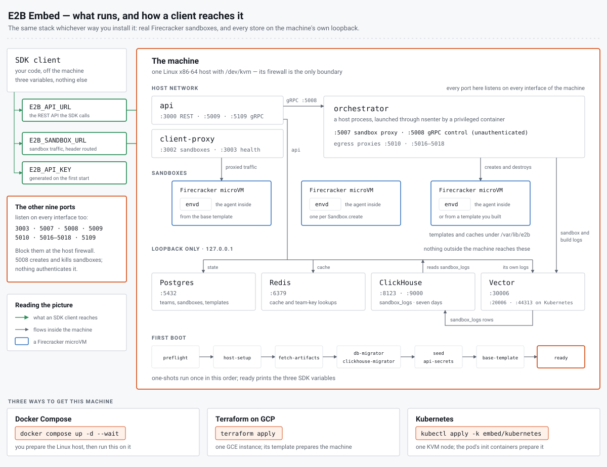

# E2B Embed

E2B Embed is a complete E2B, sandboxes included, on one machine you own. Three
ways to get that machine running, all of them the same stack.



## Pick a shape

| Shape | What you need | The install | Guide |
|-------|---------------|-------------|-------|
| Docker Compose | a Linux host with KVM that you may mutate | `docker compose up -d --wait` | [`compose/README.md`](compose/README.md) |
| Terraform on GCP | a GCP project and credentials | `terraform apply` | [`terraform/gcp/README.md`](terraform/gcp/README.md) |
| Kubernetes | a cluster with one KVM node | `kubectl apply -k` | [`kubernetes/README.md`](kubernetes/README.md) |

Compose and Terraform run [`compose/compose.yaml`](compose/compose.yaml) and
[`compose/.env`](compose/.env) as shipped, differing only in who prepares the
machine (you, or the instance template) and where the two files come from
(your download, or instance metadata). Kubernetes runs a StatefulSet
translated from them, repeating the same pins in
[`kubernetes/kustomization.yaml`](kubernetes/kustomization.yaml), which
[`tests/kubernetes.bats`](tests/kubernetes.bats) keeps in step. These are not
three architectures, and all three are single-machine evaluation packages
rather than deployment patterns; for a production deployment see
https://e2b.dev/enterprise.

## What every shape gives you

Sandboxes are real Firecracker microVMs on the machine, and everything they
need stays there: the databases, the templates you build and the logs all
live on its disk. Each install gets its own team API key, generated on the
first start. Eleven ports listen on every interface of the machine. The SDK
needs the first two. The other nine must not be reachable on any address the
machine holds: give it no public address of its own, or firewall those nine
ports for that address as well, not only at the network edge.

| Port | Service | Reachable from | Purpose |
|------|---------|----------------|---------|
| 3000 | api | trusted clients | the REST API the SDK calls |
| 3002 | client-proxy | trusted clients | sandbox traffic (header routing) |
| 3003 | client-proxy | the machine only | health |
| 5007 | orchestrator | the machine only | sandbox proxy |
| 5008 | orchestrator | the machine only | **unauthenticated** gRPC control API |
| 5009 | api | the machine only | internal gRPC |
| 5010 | orchestrator | the machine only | sandbox egress: hyperloop proxy |
| 5016 | orchestrator | the machine only | sandbox egress: TCP firewall proxy (HTTP) |
| 5017 | orchestrator | the machine only | sandbox egress: TCP firewall proxy (TLS) |
| 5018 | orchestrator | the machine only | sandbox egress: TCP firewall proxy (other) |
| 5109 | api | the machine only | edge gRPC |

Port 5008 is the one to be most careful about: it creates and kills sandboxes
and starts template builds, nothing authenticates it (the api dials it
directly as `LOCAL_ORCHESTRATOR_ADDRESS`), and anyone who reaches it has the
whole orchestrator. The four egress-proxy ports (5010 and 5016 to 5018) take
the sandbox traffic the orchestrator redirects inside each sandbox's network
namespace; they expect no client from outside the machine and have no
authentication of their own.

Everything else stays on loopback: Postgres on 5432, Redis on 6379,
ClickHouse on 8123 and 9000 (on Kubernetes also on 9004, 9005 and 9009, its
MySQL and PostgreSQL wire protocols and its interserver port, since the pod
shares the node's network), Vector's log listener on 30006 (20006 on
Kubernetes, for the reason that guide gives) and its API on 44313 on
Kubernetes only, and the two pprof endpoints, 6060 for api and 6061 for the
orchestrator. `sudo ss -ltnp` on the machine confirms the
split: the eleven ports above show a `*:` address, everything in this
paragraph shows `127.0.0.1:`.

## Reference

### What runs where

The four stores run in containers on a bridge network with their ports on
`127.0.0.1`; api, client-proxy and the released orchestrator run on the
machine's own network. The orchestrator is a host process, launched through
`nsenter` by a privileged container, the same pattern E2B's own Kubernetes
deployment uses; its launcher ends every sandbox when it stops.

Eight one-shots run before the stack is usable, in this order: `preflight`
fails fast with a `FIX:` line when the machine is unsuitable, then
`api-secrets` generates the api's admin token and sandbox-token hash seed
(it needs only the volume, so it finishes first), `host-setup` prepares the
machine on every start, `fetch-artifacts` downloads and verifies the five
Firecracker binaries, `db-migrator` and `clickhouse-migrator` bring the two
databases to the schema their pinned images expect, `seed` writes the default
team and generates this install's API key, and `base-template` builds the
default template through the API. Kubernetes runs seven of them: there the
api's two secrets come from a Secret instead. `ready` is the marker that
everything above worked: not a one-shot but a long-running container, whose
readiness is the whole stack's.

Sandbox and template-build logs live in ClickHouse. The orchestrator and the
api ship their lines (envd's output from inside the VM, the orchestrator's
per-sandbox events, the template-manager's build output, the api's own) to
Vector, which turns each into a row of the `sandbox_logs` table; the api reads
that table for the SDK's `getLogs` and `e2b template build`
(`LOGS_READ_CONFIG=true`, which fixes the api's `logs-read-config` flag where
there is no LaunchDarkly to set it). Retention is the table's seven days. There
is no Loki in this stack, and the api needs no `LOKI_URL`.

### Secrets

The team API key is per install. The seed generates it on the first start and
keeps it beside the databases, so a shape never has a key without its database
or a database without its key, and every shape prints it with the two SDK
URLs. Each guide's Secrets section says where its copy lives and how to pin or
rotate it. A rotation revokes the old key, which keeps working for up to five
minutes, because the api caches team lookups in Redis for that long.

`ADMIN_TOKEN` and `SANDBOX_ACCESS_TOKEN_HASH_SEED` are the api's own two, and
every shape generates them per install too. Compose writes them on the first
start into the volume that holds the team key (`/run/e2b/api.env` in
`seed-state`), Terraform writes generated ones into the instance's `.env` at
first boot, and Kubernetes reads the Secret the install creates. On Compose,
setting either one in `.env` pins it and leaves the other generated; each
guide's Secrets section says how to rotate what its shape holds. Both are
worth guarding: the admin token is admin over the seeded team on port 3000
without the team API key, including minting and revoking API keys (the team's
id is a public constant), and the hash seed makes the
traffic and envd tokens of `secure` sandboxes computable from a sandbox ID
by anyone who reaches 3002.

### Images and pins

[`compose/.env`](compose/.env) is the source of truth for every version the
stack uses: the four released E2B service images (api, db-migrator,
client-proxy, clickhouse-migrator), the three small stack images Embed builds
itself, which carry everything that is not a released E2B service (the host
scripts, the SDK scripts and the database seeder), and the five
Firecracker binaries. Terraform ships that file to the instance, and
Kubernetes repeats its pins in
[`kubernetes/kustomization.yaml`](kubernetes/kustomization.yaml). The three
stack images live in the `compose` repository of the `e2b-artifacts` registry,
published by the maintainers under the tag `compose/.env` pins, `v0.3.0`
today. All of it is public and pulled anonymously; the stores come from Docker
Hub.

To pin an install, pin the commit. The Compose files come from raw URLs, so
put the commit in place of `main` in their path; the Terraform `source` and the
`kubectl apply -k` URL are git URLs and take `?ref=<commit>`. The `main` URLs
the guides use give the newest. `tests/pins.bats` keeps the three pins, their
Kubernetes counterparts and the registry the images are built into in step
with each other.


Top to bottom: the source files, the Dockerfiles that copy them, the images
(three built here, eight pulled ready-made) and the compose services. Arrows
in the last band are `depends_on` gates, in start order; the stripe on each
service says which image it runs. Two things the picture leaves out: the
ClickHouse and Vector configs are inlined into `compose/compose.yaml` rather
than shipped in an image, and the five Firecracker artifacts never enter an
image at all, since `fetch-artifacts` writes them onto the machine and the
orchestrator reads them there.

### Beyond the first sandbox

`Template.build` builds your own template through the same API, on any shape:

```python
from e2b import Template, Sandbox
tpl = Template().from_python_image("3.12").run_cmd("pip install requests")
Template.build(tpl, alias="py-requests", cpu_count=2, memory_mb=1024, on_build_logs=lambda e: print(str(e)))
sbx = Sandbox.create("py-requests")
print(sbx.commands.run("python3 -c 'import requests; print(requests.__version__)'").stdout)
sbx.kill()
```

That template, one pip layer on Python 3.12, built in 53 to 79 s across runs
on an 8-vCPU / 32 GiB VM, the spread depending on how much of the base image
was already cached. The build runs inside a Firecracker VM on the machine and
pulls the image from Docker Hub; no Docker daemon is involved.

`sandbox.get_host(port)` returns `{port}-{id}.e2b.app`, which does not resolve
here. Reach a port inside a sandbox through client-proxy's header routing
instead:

```bash
curl -H "E2b-Sandbox-Id: $SANDBOX_ID" -H "E2b-Sandbox-Port: 8080" http://localhost:3002/
```

### Developing

`make` is a developer convenience; the operator path is only `docker compose`,
`terraform` or `kubectl`.

| Target | What it does |
|--------|--------------|
| `make images` | build the three stack images locally under their pinned tags |
| `make lint` | render the compose file and the kustomization, validate the Vector config and the Terraform module, shellcheck the scripts and the tests |
| `make test` | run the bats suite in `tests/` |
| `make stores-check` | the store-level integration check |
| `make sync-configs` | re-inline the two configs into the compose file |

`make lint` wants `shellcheck`, `terraform` (1.7.5 or newer; `terraform init`
downloads the google and random providers, so network) and `kubectl` (for
`kubectl kustomize`); `make test` wants `bats` plus `kubectl`, which
`tests/kubernetes.bats` renders the manifest with. `tests/terraform.bats`
reads the module's files as text and needs no terraform. Both also need a
working Docker daemon with the compose plugin and `jq` on `PATH`, because
`make lint` renders `compose/compose.yaml` and validates the Vector config
with the Vector image (`make vector-validate`), and
`tests/inline-configs.bats` diffs the rendered inline configs against the
copies under `compose/config/`.
`tests/vector-rows.bats` replays the fixture log lines in
`tests/fixtures/vector/` through the shipped Vector config with that image,
`compose/scripts/dev/vector-testconfig.py` swapping only the source for stdin
and the sink for a JSON console, and asserts the `sandbox_logs` row each
becomes or that it is dropped; it needs Docker, python3 and `jq` as well.

After editing `compose/config/vector/vector.toml` or
`compose/config/clickhouse/config.xml`, run `make sync-configs` (python3): it
rewrites the inline copies in `compose/compose.yaml` and the
`VECTOR_CONFIG_SHA256` and `CLICKHOUSE_CONFIG_SHA256` stamps that make Compose
recreate the container on a config change, which it does not do for inline
`configs:` content on its own. `tests/config-hashes.bats` fails until the
stamps match.

`make stores-check` runs what CI's stores job runs: both stores, their
migrators, the seed, and the assertions that the seed wrote the team API key
file, that the seeded row hashes that key, and that both migration ledgers
landed. It wants Docker, network access and the images from `make images`,
takes about a minute and needs no KVM, and it deliberately leaves the
containers up so a failure can be inspected, so finish with
`docker compose --project-directory compose down -v`.

The scripts under `compose/scripts/` and `compose/scripts/node/` travel inside
the two stack images that carry them, and the compose file mounts nothing from
the repository, so after editing either directory run `make images` before the
next start, or the stack silently keeps running the old code. Without `make`,
this is the `images` target (its `$$` becomes a single `$` outside of make):

```bash
set -a; . ./compose/.env; set +a
docker buildx bake --load \
  --set "seed.context=https://github.com/e2b-dev/runtime.git#${RUNTIME_COMMIT}" \
  --set seed.args.SRC=packages \
  --set "tools.tags=${E2B_TOOLS_IMAGE}" \
  --set "node-e2b.tags=${E2B_NODE_E2B_IMAGE}" \
  --set "seed.tags=${E2B_SEED_IMAGE}"
```

Binary checksums live in the tools image's `compose/scripts/fetch-artifacts.sh`,
so bumping a Firecracker artifact means new stack images, not an edit on a
machine.

### Not supported

- macOS and Windows. The stack needs a Linux x86-64 machine with KVM.
- Container-Optimized OS: the machine needs apt, a writable `/etc` and
  glibc 2.34 or newer.
- No dashboard. Only the SDK and API paths are covered.
- No wildcard DNS and no TLS.
