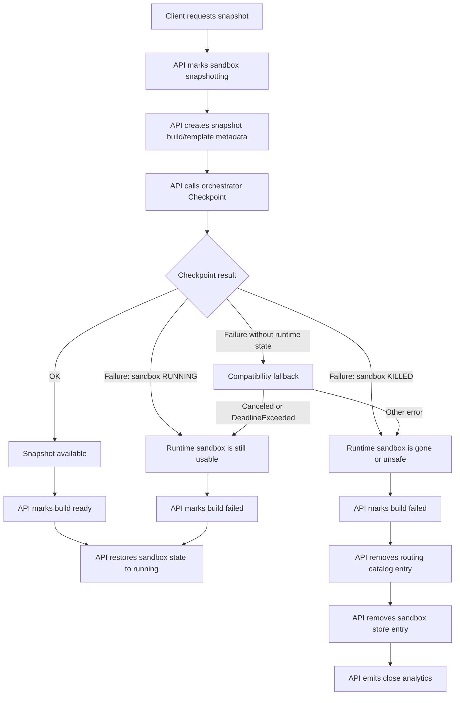

# Checkpoint Snapshot Spec

`POST /sandboxes/:id/snapshots` creates a reusable snapshot from a live sandbox. The flow spans two systems with separate sources of truth:

- API owns API-visible state: sandbox store, snapshot build status, routing catalog, and analytics.
- Orchestrator owns runtime state: Firecracker/envd lifecycle, checkpoint recovery, old sandbox stop, and resumed sandbox availability.

The boundary is: orchestrator decides the final runtime state, API mirrors it.

## Runtime State Contract

`Sandbox.Checkpoint` reports one of three outcomes:

| Result | Meaning |
| --- | --- |
| gRPC OK | Snapshot is available and sandbox was resumed. |
| `SandboxCheckpointFailure(RUNNING)` | Snapshot failed, but orchestrator kept or restored a usable sandbox. |
| `SandboxCheckpointFailure(KILLED)` | Snapshot failed and orchestrator could not keep a usable sandbox. |

The API should not infer runtime state from internal checkpoint steps. For example, upload failure and snapshot failure are both checkpoint failures, but they have different runtime outcomes.

## Snapshot Availability

The checkpoint flow has two availability modes:

| Mode | `OK` means |
| --- | --- |
| Synchronous upload | Snapshot files were uploaded to remote storage before the response. |
| Peer-to-peer async upload | Snapshot files are available from the originating orchestrator through peer routing, and remote storage upload continues in the background. |

In both modes, `OK` means the API can treat the build as ready for reuse. The difference is where the first consumers read the snapshot from while storage catches up.

## Recovery Responsibility

Orchestrator is responsible for recovery because it has the runtime truth.

It should report `RUNNING` when failure happens before runtime mutation or after a replacement sandbox is already live, such as preflight, acquire, or upload failure.

It should report `KILLED` when the old sandbox has been removed from live runtime state and no usable replacement exists, such as snapshot/cache failure or resume failure after `MarkStopping`.

API is responsible only for mirroring the reported state.

- `RUNNING`: failed build, sandbox visible as running.
- `KILLED`: failed build, sandbox removed from API state/routing/analytics.

## Unknown Runtime State

If checkpoint fails without `SandboxCheckpointFailure`, the API does not have authoritative runtime state. This should only happen for old orchestrators or transport failures.

The compatibility policy is conservative:

- `Canceled` or `DeadlineExceeded`: assume the sandbox may still be running.
- Other errors: assume the sandbox is not safe to keep in API state.
