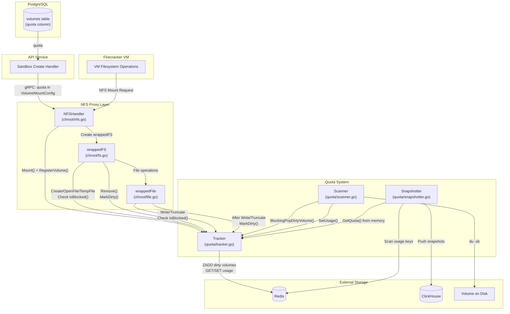

# Quota System Architecture

## Component Responsibilities

### NFSHandler (chroot/nfs.go)
- Handles NFS mount requests from VMs
- Validates sandbox ownership and volume configuration
- **Registers volume quota with Tracker** when mounting (quota comes from gRPC config)
- Creates chrooted filesystem wrappers with quota tracking
- Manages chroot lifecycle tied to sandbox lifetime

### wrappedFS (chroot/fs.go)
- Wraps billy.Filesystem operations
- **Before** `Create()`, `OpenFile()`, `TempFile()`: checks `IsBlocked()`
- **After** `Remove()`: calls `MarkDirty()` (deletion frees space)
- Returns `ErrQuotaExceeded` if volume is blocked

### wrappedFile (chroot/file.go)
- Wraps billy.File operations
- **Before** `Write()`, `Truncate()`: checks `IsBlocked()`
- **After** successful `Write()`, `Truncate()`: calls `MarkDirty()`
- Returns `ErrQuotaExceeded` if volume is blocked

### Tracker (quota/tracker.go)
- Central coordination point for quota state
- **RegisterVolume()**: Stores volume quota in memory (called when volume is mounted)
- **MarkDirty()**: Adds volume to Redis sorted set (ZADD NX) for scanning
- **IsBlocked()**: Calculates `usage >= quota` using cached usage and in-memory quota
- **SetUsage()**: Updates usage in Redis (called by Scanner)
- **GetQuota()**: Returns quota from memory (0 = unlimited)
- **PopDirtyVolume()**: Atomically removes oldest dirty volume (ZPOPMIN)

**Key Design Change**: Blocked status is **calculated on-the-fly** by comparing cached usage (from Redis) against quota (from memory). This eliminates the need to store blocked status in Redis.

### Scanner (quota/scanner.go)
- Background loop processing dirty volumes
- Pops dirty volumes from Tracker queue
- Measures actual disk usage via `du -sb`
- Updates usage in Redis via `SetUsage()`
- **No longer sets blocked status** - it's calculated on-the-fly
- Runs continuously with backoff on errors

### Snapshotter (quota/snapshotter.go)
- Background loop for billing snapshots
- Scans all volume usage keys from Redis (hourly)
- Gets quota from Tracker's memory via `GetQuota()`
- Calculates blocked status: `usage >= quota`
- Pushes snapshots to ClickHouse for billing/analytics

## Data Flow

### Quota Source Flow
1. Volume quota is stored in PostgreSQL `volumes.quota` column
2. When sandbox is created, API fetches volume info from database
3. Quota is passed to orchestrator via gRPC `SandboxVolumeMount.quota`
4. NFSHandler extracts quota from `VolumeMountConfig` and registers with Tracker

### Write Operation Flow
1. VM writes file via NFS
2. `wrappedFile.Write()` checks `tracker.IsBlocked()`:
   - Get quota from memory (0 = unlimited, not blocked)
   - Get cached usage (refreshed every 30s from Redis)
   - Return `usage >= quota`
3. If blocked → return `ErrQuotaExceeded`
4. Write proceeds to disk
5. On success, `tracker.MarkDirty()` adds volume to dirty queue

### Quota Enforcement Flow
1. Scanner calls `tracker.BlockingPopDirtyVolume()`
2. Scanner runs `du -sb` on volume path
3. Scanner calls `tracker.SetUsage()` with measured bytes
4. Usage cache expires after 30 seconds
5. Next `IsBlocked()` check recalculates from fresh usage vs quota

### Billing Snapshot Flow
1. Snapshotter wakes up on interval (1 hour)
2. Scans Redis for all `quota:volume:usage:*` keys
3. For each volume:
   - Gets usage from Redis
   - Gets quota from Tracker memory
   - Calculates blocked = `usage >= quota` (where quota > 0)
4. Pushes `VolumeUsageSnapshot` to ClickHouse delivery

## Redis Keys

Only two Redis keys are used:
- `quota:dirty_volumes` - Sorted set of volumes needing usage scan
- `quota:volume:usage:{teamID}/{volumeID}` - Current usage in bytes

**Removed keys** (no longer used):
- `quota:volume:blocked:{teamID}/{volumeID}` - Blocked status (now calculated)
- `quota:volume:quota:{teamID}/{volumeID}` - Quota limit (now in memory from gRPC)
